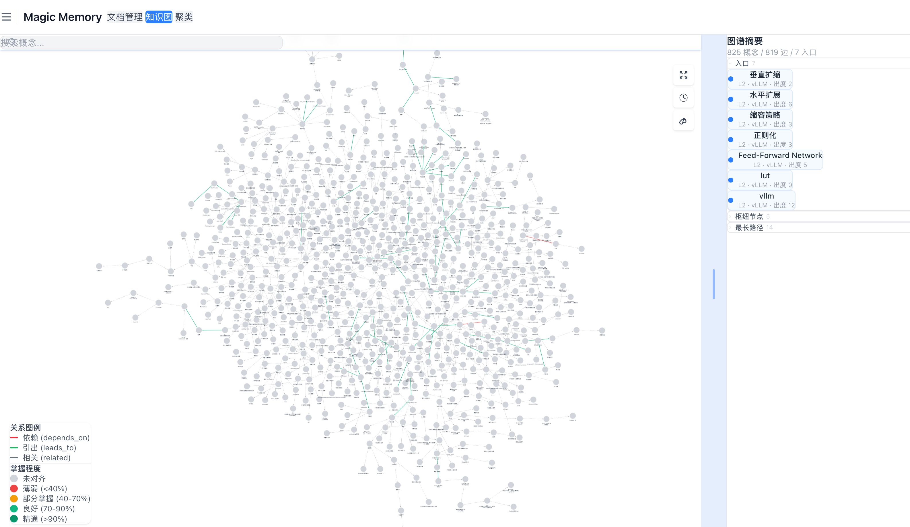
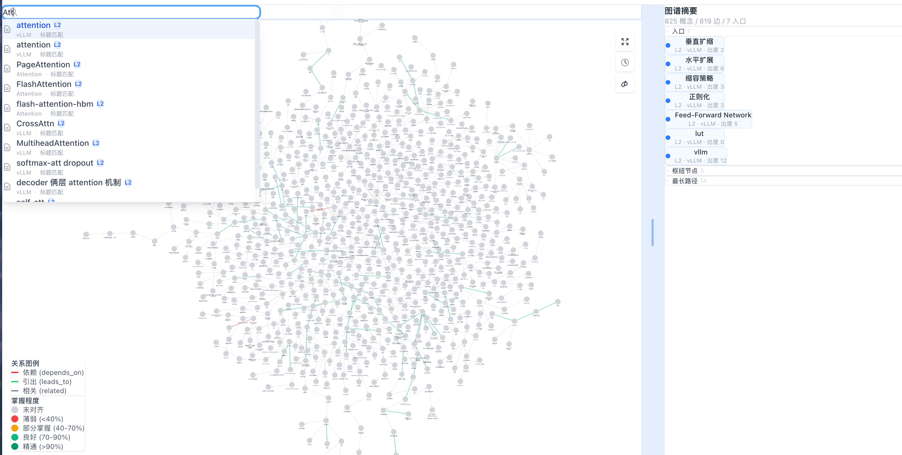
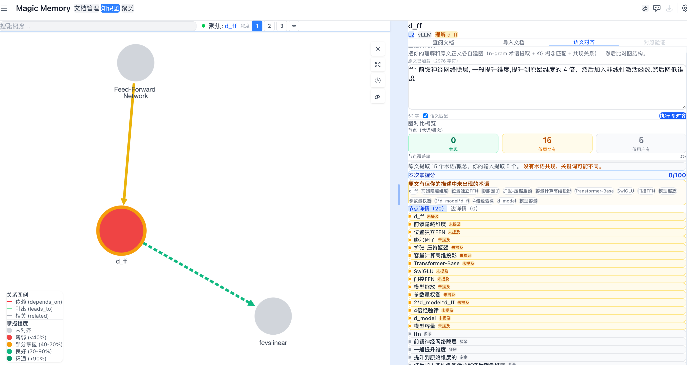
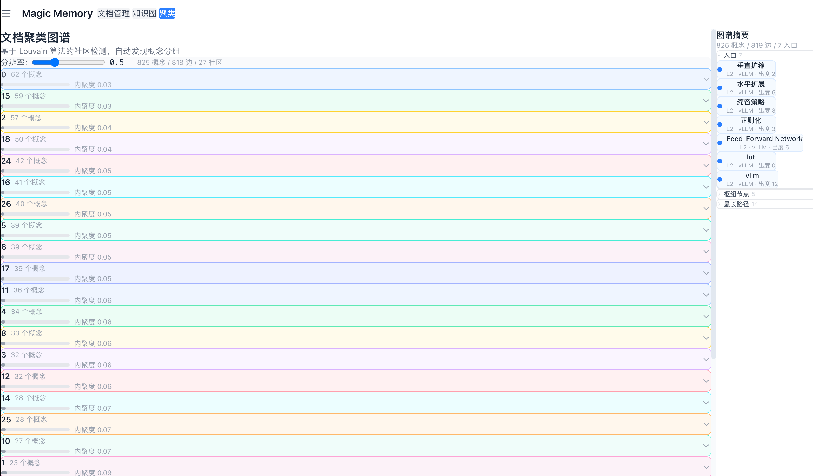
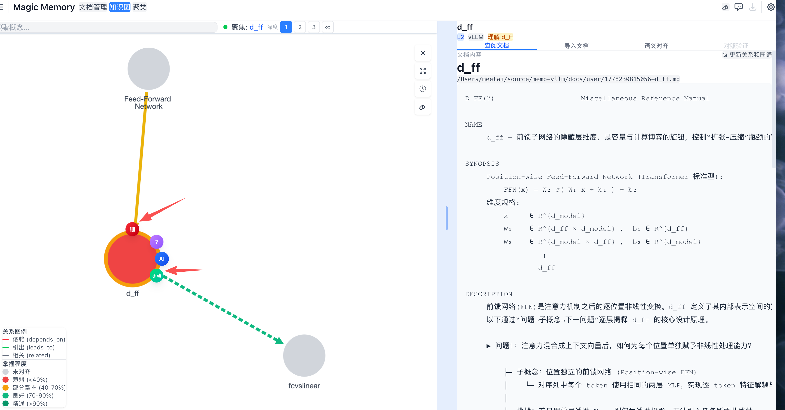
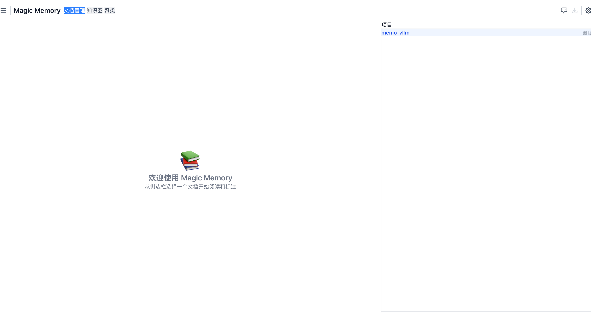

# Magic Memory

> AI 驱动的知识图谱学习系统 — 自动生成概念节点，对齐理解度评估，SM-2 间隔重复复习

---

## 快速开始

### 前置依赖

- **Node.js** ≥ 18
- **Bun** — [安装](https://bun.sh/docs/installation)：`curl -fsSL https://bun.sh/install | bash`

### 安装

```bash
git clone <repo-url> && cd magic-memory
npm install
npm install -g .          # 注册 memo 命令到全局，之后任意目录可用
```

### 使用

```bash
# 1. 初始化项目 — 扫描文档目录，自动构建知识图谱
memo init ~/notes/my-project

# 2. 启动完整服务
memo server start
# → Web UI: http://localhost:3000
# → API:    http://localhost:4321

# 3. 首次使用，点 Web UI 中的"添加项目"选择文档目录，或直接用 CLI
# 4. 在知识图谱中单击概念节点 → 阅读文档 → 对齐评估 → 复习提醒
```

### CLI 命令一览

```bash
memo init <path>         # 扫描目录构建图谱并注册
memo list                # 列出已注册项目
memo remove <id>         # 删除项目
memo server start        # 启动后端服务 + Web UI
memo server stop         # 停止所有服务
memo server status       # 查看服务运行状态
```

### 开发模式

```bash
npm install
npm run dev            # http://localhost:3000
```

---

## 功能全景

### 🧩 交互式知识图谱

由 **Cytoscape.js** 渲染的关系图谱，概念节点按掌握度着色，支持全维度交互：



| 交互 | 行为 |
|------|------|
| 单击节点 | 查看概念详情、关联文档、对齐面板 |
| 右键菜单 | 手动建链、AI 探索、聚焦视图 |
| 悬停节点 | 预览概念摘要 |
| 拖拽连线 | 连线模式下手动建立关系 |
| 搜索框 | 输入概念名即时定位 |

图谱控制：**自适应布局** / **聚焦模式**（BFS 展开关联层，深度 1-3 级可调）/ **复习模式**（显示待复习节点徽章）

---

### 🤖 AI 概念生成与建链

| 功能 | 说明 |
|------|------|
| **KEY CONCEPTS 解析** | 从文档 `# KEY CONCEPTS` 章节自动提取概念，创建节点 |
| **AI 建议建链** | 选中节点后 AI 分析 `problem` 字段，推荐关联概念 |
| **一键批量建链** | 勾选 AI 推荐列表，确认即建 |
| **探索模式** | 从节点出发，AI 生成延伸问题并提炼为新概念 |
| **快捷探索** | 选中文本一键创建节点并关联 |



---

### 📊 理解度对齐评估 (Alignment)

阅读文档后用自己的话描述，系统自动对比原文 `KEY CONCEPTS`：

```
  原文 KEY CONCEPTS              用户自述             对齐结果
  ┌─────────────────┐         ┌──────────────┐      ✅ PagedAttention
  │ PagedAttention   │         │ "Attention    │      ❌ Block Table
  │ Block Table      │ ────→   │  通过 Q/K/V   │      ⚠️ Q/K/V (模糊匹配)
  │ CacheBlock       │         │   计算权重..." │
  └─────────────────┘         └──────────────┘
```

- **三级匹配策略**：精确子串 → charJaccard 模糊 → **transformers.js 语义匹配**（浏览器端 `all-MiniLM-L6-v2`）
- **图谱级对比**：同时对比节点（概念覆盖）和边（关系理解）
- **手动干预**：标记已理解 / 忽略 / 从原文删除
- **掌握度评分**：综合对齐次数、覆盖率、手动标记，0-100 分
- **颜色反馈**：图谱节点背景色随掌握度变化（灰→黄→绿→蓝）



---

### 🔁 SM-2 间隔复习系统

每次对齐完成后自动触发 SM-2 算法排期下次复习：

- 图谱节点右上角显示复习徽章：**🔥**(逾期) / **今日** / **N天** / **New** / **✓**
- **SummaryPanel** 按 urgency 排序展示待复习队列
- 浏览器横幅提醒待复习数量和最久逾期天数
- 图谱颜色随复习进度变化





---

### 📚 文档阅读与标注

- **Markdown 渲染**：kaTeX 公式 + highlight.js 代码高亮 + mermaid 图表
- **注释系统**：评论 / 问题 / 建议 / 纠正，行内触发 + 悬停预览
- **分类筛选**：按 Foundation / Model / Attention 等分类浏览



---

### 🧭 分析面板

| 面板 | 功能 |
|------|------|
| **SummaryPanel** | 图谱统计、入口节点、枢纽、最长路径、待复习队列、复习准时率 |
| **AnalysisPanel** | 数据流路径展示与追踪 |
| **AlignmentPanel** | 当前概念对齐结果详情 |
| **ClusterView** | Louvain 社区聚类可视化 |

---

## 项目结构

```
magic-memory/
├── src/
│   ├── components/           # 27 个 React 组件
│   │   ├── KnowledgeGraph.tsx    # 图谱主组件 (Cytoscape)
│   │   ├── AlignmentPanel.tsx    # KEY CONCEPTS 对齐
│   │   ├── SummaryPanel.tsx      # 摘要 + 复习队列
│   │   ├── ExploreDialog.tsx     # AI 探索
│   │   ├── BatchLinkDialog.tsx   # 批量建链
│   │   └── ...
│   ├── store/                # Zustand 状态管理
│   │   └── knowledgeGraphStore.ts  # 核心: 概念/掌握度/复习/对齐
│   ├── utils/                # 核心算法
│   │   ├── alignment.ts      # KEY CONCEPTS 对齐
│   │   ├── semanticMatch.ts  # transformers.js 语义匹配
│   │   ├── knowledgeGraph.ts # SM-2 调度 + 复习徽章
│   │   └── graphAnalysis.ts  # 图谱分析
│   └── types/
├── server/                   # Bun API (端口 4321)
├── scripts/                  # CLI: memo / cluster
├── tests/                    # Vitest
└── docs/                     # 知识文档
```

---

## 架构

```
                  ┌──────────────────────┐
  用户自述 ──────→│  Vite SPA (端口 3000)  │────→ 浏览器端:
  文档选择        │  React 19             │     - 图谱渲染 (Cytoscape)
                  │  Zustand 状态管理       │     - Louvain 聚类
                  │  transformers.js 语义   │     - SM-2 调度
                  └──────────┬───────────┘     - KEY CONCEPTS 对齐
                             │ API
                             ↓
                  ┌──────────────────────┐
                  │  Bun HTTP (端口 4321)  │
                  │  项目注册 / 图谱持久化   │
                  │  文件扫描              │
                  └──────────────────────┘
```

---

## 技术栈

| 层级 | 技术 |
|------|------|
| **前端** | React 19 + TypeScript + Vite 6 + Tailwind CSS 4 |
| **状态** | Zustand 5 + Immer |
| **图谱** | Cytoscape.js (`@viz-js/viz`) |
| **图算法** | graphology + Louvain |
| **语义匹配** | `@xenova/transformers` (all-MiniLM-L6-v2, 浏览器端) |
| **间隔复习** | SM-2 算法（纯前端） |
| **流程图** | `@xyflow/react` (ReactFlow) |
| **文档渲染** | marked + kaTeX + highlight.js + mermaid |
| **后端** | Bun + TypeScript |
| **测试** | Vitest |
| **NLP** | jieba |

---

## 学习路径

1. **导入项目** — 选择文档目录，自动构建知识图谱
2. **浏览图谱** — 三种视图切换，了解概念全貌
3. **逐概念学习** — 单击节点 → 阅读文档 → 对齐评估
4. **间隔复习** — 跟随图谱徽章和复习队列定期回顾
5. **AI 扩展** — 使用探索/建链功能扩展图谱
