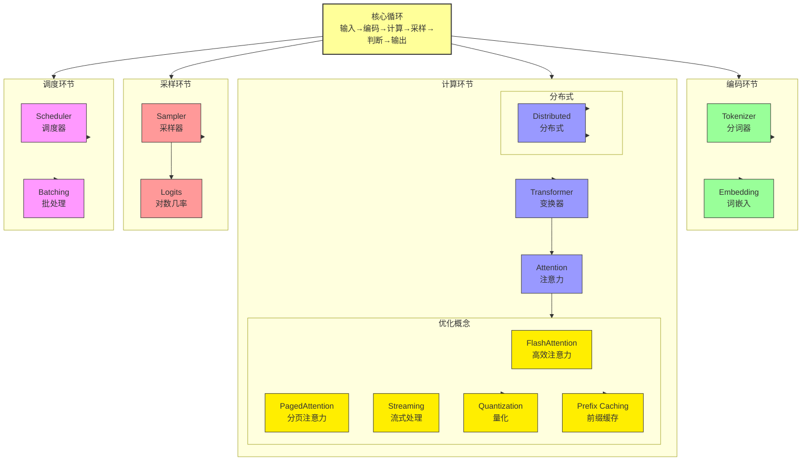

# vLLM 概念推导过程（优化版）

> **循环 → 问题 → 概念** 的完整推导，每个概念都有"来时路"

---

## 📊 总览图 (ASCII)

```
┌─────────────────────────────────────────────┐
│              [核心循环]                     │
│  输入 → 编码 → 计算 → 采样 → 判断 → 输出    │
└─────────────────────┬───────────────────────┘
                      │
    ┌─────────────────┼─────────────────┐
    │                 │                 │
┌───┴───┐         ┌───┴───┐         ┌───┴───┐
│ 编码  │         │ 计算  │         │ 采样  │
└───┬───┘         └───┬───┘         └───┬───┘
    │                 │                 │
    ▼                 ▼                 ▼
Tokenizer        Transformer         Sampler
Embedding            │                    │
                 ┌───┴───┐               │
                 │Attention│              │
                 └───┬───┘               │
           ┌───────┼───────┐              │
           │       │       │              │
           ▼       ▼       ▼              ▼
      FlashAttn PagedAttn Streaming     (输出)
           │       │
           ▼       ▼
       Quantization PrefixCache
           │       │
           ▼       ▼
        Scheduler  Batching
                      │
                      ▼
                  Distributed
```

---

## 🌳 Mermaid 树形图



---

## 🎯 快速导航

| 层级 | 概念 | 来时路 |
|------|------|--------|
| **根** | 核心循环 | - |
| **环节** | 编码/计算/采样/调度 | 从核心循环 |
| **核心组件** | Transformer, Attention | 计算环节→模型 |
| **优化概念** | FlashAttention, PagedAttention | Attention瓶颈 |
| **调度概念** | Scheduler, Batching | 调度环节 |
| **扩展概念** | Quantization, Distributed | 资源瓶颈 |

---

## 📦 概念卡片模板

每个概念都遵循这个结构：

```
┌─────────────────────────────────────────────┐
│ [概念名称]                    #编号         │
│ 来时路: 从哪来                               │
├─────────────────────────────────────────────┤
│  🔍 发现的问题                               │
│     ├── 问题1 → 解决 → 子概念               │
│     └── 问题2 → 解决 → 子概念               │
├─────────────────────────────────────────────┤
│  💡 核心公式                                 │
└─────────────────────────────────────────────┘
```

---

## 📦 概念卡片集合

### 🎯 根：核心循环

```
┌─────────────────────────────────────────────┐
│ 核心循环 (Root)                             │
│ 来时路: 系统的本质工作流程                   │
├─────────────────────────────────────────────┤
│ 输入 → 编码 → 计算 → 采样 → 判断 → 输出    │
│ (自回归生成循环)                            │
└─────────────────────────────────────────────┘
```

---

### 🔄 环节：编码

```
┌─────────────────────────────────────────────┐
│ Tokenizer (23)               分词器         │
│ 来时路: 编码环节 → 输入如何处理？           │
├─────────────────────────────────────────────┤
│ 🔍 问题链:
│   ├── 文本切成什么？→ 分词 → 分词模式
│   ├── 词表太大？→ 频次过滤 → Vocab Pruning
│   └── 未登录词？→ Byte fallback → BPE
├─────────────────────────────────────────────┤
│ 💡 Tokenizer = 分词模式 + 词表 + Byte
└─────────────────────────────────────────────┘

┌─────────────────────────────────────────────┐
│ Embedding (14)              词嵌入          │
│ 来时路: 编码环节 → Token如何变向量？        │
├─────────────────────────────────────────────┤
│ 🔍 问题链:
│   ├── ID怎么变向量？→ 查表 → 词嵌入矩阵
│   ├── 位置信息丢失？→ 位置编码 → RoPE
│   └── 位置编码类型？→ 绝对/相对 → 编码类型
├─────────────────────────────────────────────┤
│ 💡 Embedding = 查表 + 位置编码
└─────────────────────────────────────────────┘
```

---

### 🔄 环节：计算

```
┌─────────────────────────────────────────────┐
│ Transformer (15)           Transformer层    │
│ 来时路: 计算环节 → 模型如何计算？           │
├─────────────────────────────────────────────┤
│ 🔍 问题链:
│   ├── 多层如何叠加？→ 残差 → Residual
│   ├── 层间分布？→ 归一化 → LayerNorm
│   ├── 注意力怎么做？→ 多头 → Multi-Head
│   └── 非线性变换？→ 两层FC → FFN
├─────────────────────────────────────────────┤
│ 💡 Transformer = MultiHead + FFN + Res + LN
└─────────────────────────────────────────────┘

┌─────────────────────────────────────────────┐
│ Attention                    注意力机制     │
│ 来时路: Transformer → 核心组件               │
├─────────────────────────────────────────────┤
│ 🔍 问题链 (三个分叉):
│   ├── [计算量太大] → FlashAttention
│   ├── [显存碎片化] → PagedAttention  
│   └── [长序列处理] → StreamingAttention
├─────────────────────────────────────────────┤
│ 💡 Attention 是 Transformer 的核心
└─────────────────────────────────────────────┘
```

---

### 🔥 优化概念：来自 Attention

```
┌─────────────────────────────────────────────┐
│ FlashAttention (27)      高效注意力         │
│ 来时路: Attention → 计算量太大 (O(N²))      │
├─────────────────────────────────────────────┤
│ 🔍 发现方法: 瓶颈分析 (📉)
│   └── Profiling 发现 Attention 计算太慢
│
│ 🔍 问题链:
│   ├── 显存O(N²)？→ 分块 → Tiling
│   ├── 需要存QKᵀ？→ 在线计算 → Online Softmax
│   └── 梯度存储？→ 重新计算 → Recomputation
├─────────────────────────────────────────────┤
│ 💡 FlashAttention = Tiling + Online + Recompute
│ 来时路: Attention → 瓶颈分析
└─────────────────────────────────────────────┘

┌─────────────────────────────────────────────┐
│ PagedAttention (16)       分页注意力        │
│ 来时路: Attention → 显存碎片化              │
├─────────────────────────────────────────────┤
│ 🔍 发现方法: 瓶颈分析 (📉)
│   └── 显存监控发现 KV Cache 碎片化
│
│ 🔍 问题链:
│   ├── 预分配固定？→ 动态分配 → Block
│   └── 不连续内存？→ 块表映射 → Block Table
├─────────────────────────────────────────────┤
│ 💡 PagedAttention = Block + Table + Ref
│ 来时路: Attention → 瓶颈分析
└─────────────────────────────────────────────┘
```

---

### 🎛️ 调度概念

```
┌─────────────────────────────────────────────┐
│ Scheduler (35)             调度器           │
│ 来时路: 调度环节 → 多请求如何处理？         │
├─────────────────────────────────────────────┤
│ 🔍 发现方法: 对比分析 (⚖️)
│   └── 理想: 高吞吐 vs 现状: 请求堆积
│
│ 🔍 问题链:
│   ├── 先后顺序？→ 调度策略 → FCFS/Priority
│   └── GPU不够？→ 抢占 → Preemption
├─────────────────────────────────────────────┤
│ 💡 Scheduler = Policy + Preemption
│ 来时路: 调度环节 → 对比分析
└─────────────────────────────────────────────┘

┌─────────────────────────────────────────────┐
│ Batching (34)               批处理          │
│ 来时路: 调度环节 → 如何并行？               │
├─────────────────────────────────────────────┤
│ 🔍 发现方法: 需求驱动 (🎯)
│   └── 用户高并发需求
│
│ 🔍 问题链:
│   ├── 批大小固定？→ 静态批 → Static Batch
│   └── 动态加入？→ 动态批 → Continuous
├─────────────────────────────────────────────┤
│ 💡 Batching = Static/Dynamic + Policy
│ 来时路: 调度环节 → 需求驱动
└─────────────────────────────────────────────┘
```

---

### ⚡ 扩展概念

```
┌─────────────────────────────────────────────┐
│ Quantization (28)          量化             │
│ 来时路: 计算环节 → 显存不够                 │
├─────────────────────────────────────────────┤
│ 🔍 发现方法: 瓶颈分析 (📉)
│   └── 显存监控: 模型太大，显存不足
│
│ 🔍 问题链:
│   ├── 如何减少内存？→ 降精度 → INT8/INT4
│   ├── 权重怎么量化？→ 标度 → Scale
│   └── 误差如何减少？→ 校准 → Calibration
├─────────────────────────────────────────────┤
│ 💡 Quantization = Scale + 方案 + 校准
│ 来时路: 显存瓶颈 → 瓶颈分析
└─────────────────────────────────────────────┘

┌─────────────────────────────────────────────┐
│ Distributed (50)            分布式          │
│ 来时路: 计算环节 → 单卡不够                 │
├─────────────────────────────────────────────┤
│ 🔍 发现方法: 需求驱动 (🎯)
│   └── 用户需求: 更大模型
│
│ 🔍 问题链:
│   ├── 单卡不够？→ 多卡 → TP/PP/EP
│   └── 参数怎么分？→ 切分 → Sharding
├─────────────────────────────────────────────┤
│ 💡 Distributed = TP/PP + Sharding + NCCL
│ 来时路: 显存瓶颈 → 需求驱动
└─────────────────────────────────────────────┘
```

---

### 📦 完整50概念卡片索引

| # | 概念 | 层级 | 来时路 | 核心公式 |
|---|------|------|--------|----------|
| 0 | VllmConfig | 基础 | 系统配置 | 配置中心 |
| 1 | Device | 基础 | 硬件抽象 | GPU抽象 |
| 2 | Tensor | 基础 | 数据表示 | 张量 |
| 3 | Logger | 基础 | 日志追踪 |  Logging |
| 4 | vllm-core | 基础 | 核心库 | 基础 |
| 5 | GpuAllocator | 基础 | 显存分配 | Block管理 |
| 6 | Error Handling | 基础 | 错误处理 | 异常 |
| 7 | Init | 基础 | 初始化 | 启动 |
| 8 | Foundation | 基础 | 基础层 | 底层 |
| 9 | KV Cache | 缓存 | Attention→存储 | K/V存储 |
| 10 | ModelRegistry | 模型 | 系统入口 | 注册 |
| 11 | ModelLoader | 模型 | Registry→加载 | 加载器 |
| 12 | Model | 模型 | Loader→执行 | 模型本体 |
| 13 | ModelRunner | 模型 | 执行环境 | 运行时 |
| 14 | Embedding | 编码 | Token→向量 | 词嵌入 |
| 15 | Transformer | 计算 | 模型核心 | 多层堆叠 |
| 16 | PagedAttention | 计算 | Attention→显存 | 分页管理 |
| 17 | Block Table | 计算 | Paged→映射 | 块表 |
| 18 | CacheBlock | 计算 | 物理存储 | 块单位 |
| 19 | KVCacheManager | 计算 | 缓存管理 | 分配释放 |
| 20 | Sampler | 采样 | Logits→Token | 采样策略 |
| 21 | Sampling Params | 采样 | 采样控制 | 参数 |
| 22 | Logits | 采样 | 模型输出 | 原始分数 |
| 23 | Token | 采样 | 输出单元 | 词元 |
| 24 | Decode Step | 采样 | 循环 | 步进 |
| 25 | Forward Pass | 计算 | 单次计算 | 前向传播 |
| 26 | GPU Memory Pool | 基础 | 显存管理 | 内存池 |
| 27 | FlashAttention | 计算 | Attention→计算 | 高效算法 |
| 28 | Quantization | 优化 | 显存→压缩 | 精度压缩 |
| 29 | Weights Loading | 模型 | 加载权重 | 读取 |
| 30 | Speculative Decoding | 优化 | 自回归→加速 | 推测 |
| 31 | Draft Token | 优化 | Speculative→起草 | 起草 |
| 32 | Verifier | 优化 | Speculative→验证 | 验证器 |
| 33 | N-gram Proposer | 优化 | 起草方案 | N元提议 |
| 34 | Batching | 调度 | 多请求→并行 | 批处理 |
| 35 | Scheduler | 调度 | 请求管理 | 调度器 |
| 36 | Prefill | 调度 | 请求阶段 | 预填充 |
| 37 | Decode | 调度 | 请求阶段 | 解码 |
| 38 | Prefix Caching | 优化 | 重复计算→缓存 | 前缀缓存 |
| 39 | Request Queue | 调度 | 请求存储 | 队列 |
| 40 | vllm-engine | 服务 | 引擎 | 核心引擎 |
| 41 | Engine API | 服务 | 对外接口 | API |
| 42 | vllm-serving | 服务 | 服务层 | 部署 |
| 43 | OpenAI API | 服务 | 协议兼容 | OpenAI |
| 44 | gRPC | 服务 | 高效通信 | RPC |
| 45 | WebSocket | 服务 | 流式输出 | 实时 |
| 46 | Multi-Lora | 扩展 | 多模型 | LoRA |
| 47 | GPU Driver | 基础 | 硬件驱动 | 驱动 |
| 48 | Prefix Lookup | 优化 | 缓存→查找 | 查找 |
| 49 | Cache Eviction | 优化 | 缓存→清理 | 驱逐 |
| 50 | Distributed | 扩展 | 单卡→多卡 | 分布式 |

---

## 🔑 核心公式总结

```
推导公式:
    来时路 → 问题 → 解决 → 概念

发现方法:
    🔄 流程分析 → 从工作流程自然发现
    📉 瓶颈分析 → 从性能瓶颈倒推
    ⚖️ 对比分析 → 理想vs现状差距
    🎯 需求驱动 → 从用户需求追溯
```

---

## 🗂️ 完整推导树

```
核心循环 (根)
    │
    ├── 编码环节
    │   └── Tokenizer → Embedding
    │
    ├── 计算环节
    │   ├── Transformer
    │   │   │
    │   │   └── Attention (核心组件)
    │   │       │
    │   │       ├── 📉 FlashAttention (计算瓶颈)
    │   │       ├── 📉 PagedAttention (显存瓶颈)
    │   │       └── 🎯 Streaming (长序列需求)
    │   │
    │   ├── Quantization (显存瓶颈)
    │   └── Distributed (单卡不够)
    │
    ├── 采样环节
    │   └── Sampler
    │
    └── 调度环节
        ├── Scheduler
        ├── Batching
        └── Prefix Cache (重复计算)
```