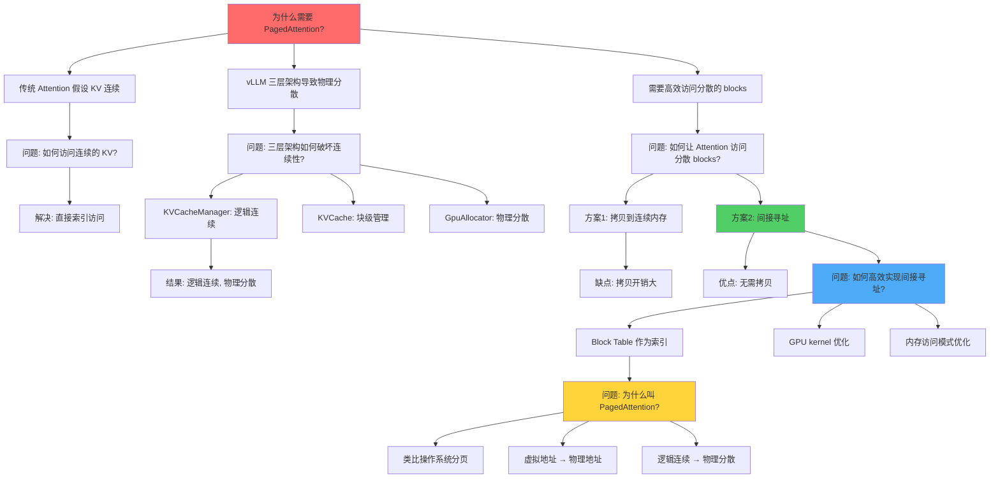

# PagedAttention 知识树

## 🎯 核心问题

**为什么需要 PagedAttention？**

传统 Attention 计算假设 KV Cache 是连续的内存块，但 vLLM 的三层架构（KVCacheManager → KVCache → GpuAllocator）导致：
- **逻辑连续，物理不连续**：同一个 sequence 的 KV blocks 在物理内存中分散
- **动态分配**：blocks 随时可能被移动、换出、重新分配
- **多序列并发**：不同 sequences 的 blocks 交错存储

**问题**：Attention kernel 如何高效访问这些分散的物理 blocks？

---

## 🔍 问题链

### 问题 1：传统 Attention 如何访问 KV？

**传统假设**：
```
Sequence i 的 KV Cache:
┌─────────────────────────────────────┐
│ [token0] [token1] [token2] [token3] │  ← 连续内存
│  K0 V0   K1 V1   K2 V2   K3 V3      │
└─────────────────────────────────────┘
   物理地址: 0x1000 → 0x2000 → 0x3000 → 0x4000
```

**Attention 计算**：
```python
# 传统实现
for i in range(seq_len):
    for j in range(seq_len):
        attention[i, j] = softmax(Q[i] @ K[j].T) @ V[j]
        # 直接通过索引访问 K[j], V[j]
```

**问题**：假设 `K[j]` 和 `V[j]` 在连续内存中，可以通过 `base_addr + j * block_size` 直接计算地址。

---

### 问题 2：vLLM 的三层架构如何破坏连续性？

**三层架构**：
```
┌─────────────────────────────────────────┐
│ KVCacheManager (序列层)                 │
│ ┌─────────────────────────────────────┐ │
│ │ Sequence 0: [block0, block2, block5]│ │  ← 逻辑连续
│ │ Sequence 1: [block1, block3, block4]│ │
│ └─────────────────────────────────────┘ │
├─────────────────────────────────────────┤
│ KVCache (块层)                          │
│ ┌─────────────────────────────────────┐ │
│ │ block0 → 0x1000  │ block1 → 0x5000  │ │  ← 物理分散
│ │ block2 → 0x3000  │ block3 → 0x7000  │ │
│ │ block4 → 0x9000  │ block5 → 0x2000  │ │
│ └─────────────────────────────────────┘ │
├─────────────────────────────────────────┤
│ GpuAllocator (物理层)                   │
│ ┌─────────────────────────────────────┐ │
│ │ 0x1000: [K0, V0]  │ 0x2000: [K5, V5]│ │
│ │ 0x3000: [K2, V2]  │ 0x5000: [K1, V1]│ │
│ │ 0x7000: [K3, V3]  │ 0x9000: [K4, V4]│ │
│ └─────────────────────────────────────┘ │
└─────────────────────────────────────────┘
```

**问题**：
- Sequence 0 的 tokens 逻辑上连续（block0, block2, block5）
- 但物理地址分散（0x1000, 0x3000, 0x2000）
- 传统 Attention 无法通过简单索引访问

---

### 问题 3：如何让 Attention kernel 访问分散的 blocks？

**方案 1：拷贝到连续内存**
```python
# 每次计算前拷贝
continuous_kv = []
for block_id in block_table:
    continuous_kv.append(copy_from_gpu(block_id))
# 然后计算 attention
```

**问题**：
- ❌ 拷贝开销大
- ❌ 浪费内存
- ❌ 破坏动态分配的优势

**方案 2：间接寻址（PagedAttention 的方案）**
```python
# 使用 block table 作为索引
for i in range(seq_len):
    block_id = block_table[i // block_size]
    offset = i % block_size
    addr = block_to_addr[block_id] + offset
    K[i] = load_from_gpu(addr)
```

**优势**：
- ✅ 无需拷贝
- ✅ 直接访问物理内存
- ✅ 支持动态分配

---

### 问题 4：如何高效实现间接寻址？

**PagedAttention 的核心创新**：
1. **Block Table 作为索引**：每个 sequence 有一个 block table，记录逻辑位置到物理 block 的映射
2. **GPU kernel 优化**：在 CUDA kernel 中实现间接寻址
3. **内存访问模式优化**：利用 GPU 的缓存和内存带宽

**CUDA kernel 伪代码**：
```cuda
__global__ void paged_attention_kernel(
    float* Q,                    // Query [seq_len, d_model]
    int* block_tables,           // Block tables [num_seqs, max_blocks]
    float* block_cache,          // Physical block cache [num_blocks, block_size, 2, d_model]
    float* output,              // Output [seq_len, d_model]
    int seq_len,                // Sequence length
    int block_size,             // Block size
    int d_model                 // Model dimension
) {
    int seq_idx = blockIdx.x;
    int token_idx = threadIdx.x;

    if (token_idx >= seq_len) return;

    // 1. 找到对应的 block
    int block_idx = token_idx / block_size;
    int block_id = block_tables[seq_idx * max_blocks + block_idx];

    // 2. 找到 block 内的偏移
    int offset = token_idx % block_size;

    // 3. 计算物理地址
    float* K = &block_cache[block_id * block_size * 2 * d_model + offset * d_model];
    float* V = &block_cache[block_id * block_size * 2 * d_model + (offset + block_size) * d_model];

    // 4. 计算 attention
    float score = 0.0f;
    for (int j = 0; j < seq_len; j++) {
        int j_block_idx = j / block_size;
        int j_block_id = block_tables[seq_idx * max_blocks + j_block_idx];
        int j_offset = j % block_size;

        float* j_K = &block_cache[j_block_id * block_size * 2 * d_model + j_offset * d_model];
        float* j_V = &block_cache[j_block_id * block_size * 2 * d_model + (j_offset + block_size) * d_model];

        score += Q[token_idx * d_model] * j_K[0];  // 简化版
    }

    output[seq_idx * seq_len + token_idx] = softmax(score);
}
```

---

### 问题 5：为什么叫 "PagedAttention"？

**类比操作系统分页**：
```
操作系统虚拟内存:
┌─────────────────────────────────────┐
│ 虚拟地址空间 (连续)                  │
│  ┌───┬───┬───┬───┬───┬───┐         │
│  │ 0 │ 1 │ 2 │ 3 │ 4 │ 5 │  ← 页表  │
│  └───┴───┴───┴───┴───┴───┘         │
└─────────────────────────────────────┘
           ↓ 页表映射
┌─────────────────────────────────────┐
│ 物理内存 (分散)                      │
│  ┌───┬───┬───┬───┬───┬───┐         │
│  │ 5 │ 2 │ 0 │ 3 │ 4 │ 1 │  ← 物理页│
│  └───┴───┴───┴───┴───┴───┘         │
└─────────────────────────────────────┘
```

**vLLM PagedAttention**：
```
KV Cache 虚拟视图 (连续):
┌─────────────────────────────────────┐
│ Sequence 0                          │
│  ┌───┬───┬───┬───┬───┬───┐         │
│  │ 0 │ 1 │ 2 │ 3 │ 4 │ 5 │  ← 逻辑 │
│  └───┴───┴───┴───┴───┴───┘         │
└─────────────────────────────────────┘
           ↓ Block Table 映射
┌─────────────────────────────────────┐
│ 物理内存 (分散)                      │
│  ┌───┬───┬───┬───┬───┬───┐         │
│  │ 0 │ 2 │ 5 │ 1 │ 3 │ 4 │  ← 物理 │
│  └───┴───┴───┴───┴───┴───┘         │
└─────────────────────────────────────┘
```

**命名原因**：
- ✅ **Paged**：像操作系统分页一样，使用 block table 实现逻辑连续、物理分散
- ✅ **Attention**：这是 Attention 计算的优化版本
- ✅ **核心思想**：通过间接寻址，让 Attention kernel 无需关心物理内存布局

---

## 💡 核心公式

```
PagedAttention = 传统 Attention + 间接寻址

传统 Attention:
  attention[i, j] = softmax(Q[i] @ K[j].T) @ V[j]
  假设: K[j], V[j] 在连续内存中

PagedAttention:
  attention[i, j] = softmax(Q[i] @ K[lookup(j)].T) @ V[lookup(j)]
  lookup(j) = block_table[j // block_size] * block_size + (j % block_size)
  实际: K[lookup(j)], V[lookup(j)] 在分散的物理内存中
```

---

## 🌳 完整推导树



---

## 📊 与三层架构的关系

```
┌─────────────────────────────────────────────────────────┐
│                    PagedAttention                        │
│  (Attention 计算层)                                       │
│  ┌─────────────────────────────────────────────────────┐ │
│  │ 输入: Q, Block Tables                                │ │
│  │ 处理: 间接寻址 + Attention 计算                      │ │
│  │ 输出: Attention Output                               │ │
│  └─────────────────────────────────────────────────────┘ │
└─────────────────────────────────────────────────────────┘
                           ↓ 使用
┌─────────────────────────────────────────────────────────┐
│                  KVCacheManager                          │
│  (序列管理层)                                             │
│  ┌─────────────────────────────────────────────────────┐ │
│  │ 管理: Block Tables (逻辑 → 物理映射)                 │ │
│  │ 提供: block_tables[num_seqs, max_blocks]            │ │
│  └─────────────────────────────────────────────────────┘ │
└─────────────────────────────────────────────────────────┘
                           ↓ 使用
┌─────────────────────────────────────────────────────────┐
│                      KVCache                             │
│  (块管理层)                                               │
│  ┌─────────────────────────────────────────────────────┐ │
│  │ 管理: 固定大小 blocks                                │ │
│  │ 提供: block_to_addr[block_id] 映射                  │ │
│  └─────────────────────────────────────────────────────┘ │
└─────────────────────────────────────────────────────────┘
                           ↓ 使用
┌─────────────────────────────────────────────────────────┐
│                    GpuAllocator                          │
│  (物理内存层)                                             │
│  ┌─────────────────────────────────────────────────────┐ │
│  │ 管理: 物理内存分配                                    │ │
│  │ 提供: 物理内存池                                      │ │
│  └─────────────────────────────────────────────────────┘ │
└─────────────────────────────────────────────────────────┘
```

---

## 🎯 关键洞察

1. **逻辑与物理分离**：PagedAttention 的核心是让 Attention kernel 只关心逻辑位置，不关心物理布局
2. **间接寻址的代价**：虽然增加了寻址开销，但避免了拷贝开销，整体更优
3. **GPU 友好**：间接寻址在 GPU 上可以通过共享内存和缓存优化
4. **动态性支持**：支持 blocks 的动态移动、换出、重新分配

---

## 📚 相关概念

- **KVCacheManager**：提供 block tables
- **KVCache**：管理 block 到地址的映射
- **GpuAllocator**：管理物理内存分配
- **FlashAttention**：优化 Attention 计算的内存访问
- **PagedAttention**：在 FlashAttention 基础上支持间接寻址

---

## 🔬 发现方法

- 🔄 **流程分析**：从传统 Attention 的内存访问流程发现问题
- 📉 **瓶颈分析**：拷贝开销是性能瓶颈
- ⚖️ **对比分析**：对比拷贝方案和间接寻址方案
- 🎯 **需求驱动**：需要支持动态分配和高效访问

---

## 📝 总结

**PagedAttention 的本质**：
- 不是新的 Attention 算法
- 是传统 Attention 在分散内存布局下的高效实现
- 通过间接寻址实现逻辑连续、物理分散的访问

**为什么叫 PagedAttention**：
- 借鉴操作系统分页的思想
- Block Table 类似页表
- 实现逻辑地址到物理地址的映射

**与三层架构的关系**：
- PagedAttention 是计算层
- 依赖 KVCacheManager 提供的 block tables
- 依赖 KVCache 和 GpuAllocator 管理的物理内存
