# vLLM 模型量化知识树

## 🎯 核心问题

**为什么需要模型量化？**

大型语言模型（LLM）的参数量巨大（7B、13B、70B+），导致：
- **显存占用高**：FP16 权重需要 2 bytes/parameter，70B 模型需要 140GB 显存
- **推理速度慢**：高精度计算需要更多 GPU 周期
- **部署成本高**：需要昂贵的 GPU 硬件

**问题**：如何在保持模型精度的同时，减少显存占用和提升推理速度？

---

## 🔍 问题链

### 问题 1：量化的基本原理是什么？

**量化本质**：将高精度数值（FP32/FP16）映射到低精度数值（INT8/INT4/FP8）

**核心公式**：
```
量化：x_q = round(x_fp / scale + zero_point)
反量化：x_fp = (x_q - zero_point) * scale
```

**关键参数**：
- **scale**：缩放因子，决定量化范围
- **zero_point**：零点偏移，用于对称/非对称量化
- **group_size**：分组大小，per-tensor/per-channel/per-block

**问题**：如何选择合适的 scale 和 zero_point？

#### 🧠 认知推导树：如何选择合适的 scale 和 zero_point？

为了理解"如何选择合适的 scale 和 zero_point"，我们构建一个最小问题探索树，将大问题拆解为递进的小问题，通过回答它们来构建认知。

```
根问题: 如何选择合适的 scale 和 zero_point？
├─ 第一层: 它们由什么决定？
│   ├─ Q1: scale 和 zero_point 在数学上如何关联于浮点范围与整型范围？
│   └─ Q2: 整型量化范围通常有哪些？对称/非对称模式如何影响 zero_point？
├─ 第二层: 浮点范围从何而来？
│   ├─ Q3: 最直接的方法（min-max）有什么隐患？
│   └─ Q4: 除了 min-max，有哪些校准方法能更智能地确定裁剪范围？
│       ├─ Q4.1: 如何用 MSE 最小化量化误差？
│       ├─ Q4.2: KL 散度校准如何保留分布信息？
│       └─ Q4.3: 百分位数法如何对抗离群点？
└─ 第三层: 确定范围时还要考虑什么？
    ├─ Q5: 分组粒度（per-tensor / per-channel / per-block）怎样改变 scale/zero_point 的数量与精度？
    └─ Q6: 实际工程落地时，选择 scale 和 zero_point 的完整流程是什么？
```

**Q1：scale 和 zero_point 在数学上如何关联于浮点范围与整型范围？**

量化是把一个浮点值 r 映射为整数 q，核心是两个参数：

- **scale（步长）**：Δ = (r_max - r_min) / (q_max - q_min)
- **zero_point（零点）**：Z = q_min - round(r_min / Δ)

其作用是补偿零点偏移，使得 r=0 能被精确表示（对 padding、ReLU 等重要）。

反过来：给定浮点范围 [r_min, r_max] 和整型范围 [q_min, q_max]，scale 和 zero_point 就被唯一确定。可见选择这两个参数的本质，就是选择浮点数的裁剪范围 [r_min, r_max]。

**Q2：整型量化范围通常有哪些？对称/非对称模式如何影响 zero_point？**

不同位宽和符号模式决定了 q_min, q_max，进而影响 scale 和 zero_point：

- **非对称量化（如 uint8）**：[0, 255]
  - zero_point ≠ 0（一般为整数）
  - scale = (r_max - r_min)/255
  - 适合含有偏置、仅正值的分布（例如 ReLU 输出）

- **对称量化（如 int8）**：[-128, 127]
  - 强制 r_min = -r_max，此时 zero_point = 0
  - 计算效率更高，省去 zero_point 的加减运算
  - 量化/反量化对称

选择对称还是非对称，决定了 zero_point 是否为 0，进而影响我们选择浮点最大/最小值的策略。比如对称量化只需确定一个最大绝对值。

**Q3：最直接的方法（min-max）有什么隐患？**

最朴素的想法：从校准数据中统计 r_min = min(data), r_max = max(data)，再套用公式计算出 scale 和 zero_point。这就是 **MinMax 校准**。

**隐患**：对离群点极度敏感。如果数据中出现一个极端值，整个张量的 scale 会被拉大，大量正常值会被量化到一个极窄的区间，舍入误差暴涨，模型精度严重下降。

这引出了下一个核心问题：能不能牺牲少数离群点，换取大多数值的量化精度？

**Q4：有哪些校准方法能更智能地确定裁剪范围？**

解决 Q3 的思路是：人为裁剪一个比实际 min/max 更窄的区间 [a, b]，让多数值落在里面，超出部分直接饱和截断。那么怎样才算"更优"的区间？有几种主流方法：

**Q4.1：MSE（均方误差）校准**

- **原理**：在量化层上，对校准数据的浮点输入和量化-反量化后的输出，计算 L2 误差
- **方法**：在 [min, max] 范围内搜索一个裁剪阈值（对称时只搜最大绝对值），找到使 MSE 最小的那个阈值
- **优势**：直接优化量化误差，工业界非常常用（如 TensorRT 的 ENTROPY_CALIBRATION_2 实际也包含 MSE 搜索）

**Q4.2：KL 散度校准**

- **原理**：不直接看值误差，而是看分布相似度
- **方法**：将原始浮点分布和量化后的分布（离散整数）都视为概率分布，计算它们的 KL 散度
- **应用**：在一定的阈值下，截断高尾部数据，使 KL 散度最小，保留最多的分布信息
- **典型**：NVIDIA TensorRT 的历史方案，将浮点直方图合并量化区间，最小化 KL 散度

**Q4.3：百分位数法**

- **原理**：假设数据存在少量离群点，直接按百分位裁剪
- **方法**：如取 r_min = percentile(data, 0.1%)，r_max = percentile(data, 99.9%)，丢弃两端 0.2% 的极端值
- **优势**：既简单又鲁棒，对于 BERT、LLM 等激活值分布效果很好

这三种方法找到最优裁剪范围后，再套用 Q1 的公式，自然得到 scale 和 zero_point。

**Q5：分组粒度怎样改变 scale/zero_point 的选择？**

即使确定了校准方法，scale 和 zero_point 的"组"数也会影响选择结果，因为我们在"组"内共享参数：

- **per-tensor**：整个张量共用一套 scale/zero_point
  - 参数最少，但组内范围差异大时误差大
  - 适合分布较均匀的层

- **per-channel**：对卷积核的每个输出通道或有共享维度的轴，独立计算 scale/zero_point
  - 大幅降低通道间的误差
  - 是权重量化的标配（例如 int8 卷积权重的 per-channel 量化）

- **per-block / group-wise**：把张量分成更小的块（如每 128 个数一组）分别量化
  - 细粒度进一步降低误差
  - 常用于 int4 权重量化（如 GPTQ、AWQ）
  - 代价是需储存更多 scale/zero_point

选择分组粒度时，需要在精度和存储/计算开销间权衡。越细的粒度，scale/zero_point 越能贴合局部分布，误差越小。

**Q6：实际工程中，选择 scale 和 zero_point 的完整流程是什么？**

结合以上探索，整个认知落地为以下步骤：

1. **确定量化位宽与对称性**：int8/int4，对称 or 非对称 → 定下 [q_min, q_max] 和 zero_point 是否为 0

2. **确定分组粒度**：权重量化常用 per-channel（Conv）或 group-wise（LLM int4），激活量化常用 per-tensor

3. **收集校准数据**：跑少量有代表性的输入样本，记录每层张量的输出（激活）或权重值

4. **校准裁剪范围**：对每个组用 MinMax / MSE / KL / Percentile 计算出最优 [r_min, r_max] 或对称的 max(|r|)

5. **计算 scale 与 zero_point**：
   - 非对称：Δ = (r_max - r_min) / (q_max - q_min), Z = q_min - round(r_min / Δ)
   - 对称：Δ = max(|r|) / max(|q|), Z = 0

6. **推理部署**：导出固定参数的量化模型，运算时将输入按组量化，结果反量化

**最终答案（回归根问题）**

选择合适的 scale 和 zero_point，本质上就是为每个量化组选择一个最佳的浮点裁剪范围 [r_min, r_max]。这个选择需要综合考虑：

- 整型范围与对称性（定义了公式框架）
- 校准数据的实际分布（通过 MSE、KL、百分位数等抗离群值的方法确定最优范围）
- 分组粒度（在精度与开销间折衷）

通过这棵"最小问题探索树"，我们从最底层的数学定义，一步步推到了工业界的实用校准流程。

---

### 问题 2：有哪些量化精度格式？

#### 2.1 整数量化（INT）

| 格式 | 精度 | 范围 | 内存节省 | 典型用途 |
|------|------|------|----------|----------|
| **INT8** | 8-bit | [-128, 127] | 4x | 通用量化 |
| **INT4** | 4-bit | [-8, 7] | 8x | 极致压缩 |
| **INT2** | 2-bit | [-2, 1] | 16x | 实验性 |

**问题**：INT4 精度损失太大，如何补偿？

#### 🧠 认知推导树：如何补偿 INT4 精度损失？

```
根问题: INT4 精度损失太大，如何补偿？
├─ 第一层: 精度损失从何而来？
│   ├─ Q1: INT4 的量化范围有多小？
│   └─ Q2: 为什么小范围会导致大误差？
├─ 第二层: 如何在有限范围内提升精度？
│   ├─ Q3: 能否改变量化范围本身？
│   ├─ Q4: 能否优化 scale 的选择？
│   └─ Q5: 能否在计算时补偿？
└─ 第三层: 实际方案有哪些？
    ├─ Q6: AWQ 如何通过激活感知补偿？
    ├─ Q7: GPTQ 如何通过 Hessian 近似补偿？
    └─ Q8: 混合精度如何平衡？
```

**Q1：INT4 的量化范围有多小？**

INT4 只有 4 个比特，能表示的整数范围非常有限：

- **有符号 INT4**：[-8, 7]，共 16 个值
- **无符号 INT4**：[0, 15]，共 16 个值

相比 INT8 的 256 个值，INT4 的表示能力减少了 16 倍。

**Q2：为什么小范围会导致大误差？**

量化误差主要来自两个方面：

1. **舍入误差**：连续的浮点值被强制映射到离散的整数
2. **截断误差**：超出范围的值被强制截断到边界

INT4 的范围太小，导致：
- 正常分布的权重值可能超出范围，产生大量截断
- 即使在范围内，16 个离散值也无法精确表示连续分布
- 舍入误差累积，影响模型精度

**Q3：能否改变量化范围本身？**

不能直接改变 INT4 的整数范围（硬件固定），但可以：

- **调整浮点裁剪范围**：通过更智能的校准方法（MSE、KL、百分位数）选择最优的 [r_min, r_max]
- **非对称量化**：使用 uint8 的 [0, 15] 范围，更适合正数分布
- **分组量化**：per-channel 或 per-block，让每个组有自己的范围

**Q4：能否优化 scale 的选择？**

可以，通过更精细的校准方法：

- **MSE 校准**：最小化量化后的均方误差
- **KL 散度校准**：保留分布信息，减少信息损失
- **百分位数法**：牺牲离群点，保护主流分布

这些方法都能找到更优的 scale，从而在有限范围内最大化精度。

**Q5：能否在计算时补偿？**

可以，通过以下方式：

- **混合精度计算**：权重用 INT4，激活用 FP16/BF16
- **逐层补偿**：在每层后添加补偿项
- **端到端微调**：量化后进行少量训练，调整权重

**Q6：AWQ 如何通过激活感知补偿？**

AWQ（Activation-aware Weight Quantization）的核心思想：

1. **分析激活分布**：统计每层输入激活的分布
2. **识别重要权重**：激活值大的权重更重要（对输出影响大）
3. **选择性量化**：对重要权重使用更高精度或特殊处理
4. **缩放补偿**：对量化后的权重进行缩放补偿

**关键公式**：
```
重要性分数 = |激活| × |权重|
保护重要权重 = 重要性分数 > 阈值 → 不量化或使用更高精度
```

**Q7：GPTQ 如何通过 Hessian 近似补偿？**

GPTQ（GPT Quantization）的核心思想：

1. **Hessian 矩阵**：计算权重对输出的二阶导数，反映权重的重要性
2. **近似计算**：使用对角近似或低秩近似，避免计算完整 Hessian
3. **逐层优化**：每层量化时，最小化 Hessian 加权的量化误差
4. **迭代更新**：量化一个权重后，更新剩余权重的 Hessian

**关键公式**：
```
量化误差 = ||W - W_quant||²_H
Hessian 近似：H ≈ diag(∂²L/∂W²)
优化目标：min ||W - W_quant||²_H
```

**Q8：混合精度如何平衡？**

混合精度策略：

- **W4A16**：4-bit 权重 + 16-bit 激活
  - 权重压缩 4x
  - 激活保持高精度
  - 典型：AWQ, Marlin

- **W8A8**：8-bit 权重 + 8-bit 激活
  - 权重和激活都压缩 2x
  - 需要硬件加速
  - 典型：FP8, INT8

- **逐层混合**：不同层使用不同精度
  - 重要层（如 attention）使用更高精度
  - 次要层（如 FFN）使用更低精度

**最终答案**

INT4 精度损失的补偿方法：

1. **优化量化范围**：通过 MSE、KL、百分位数等智能校准
2. **激活感知量化**：AWQ 通过激活分布识别重要权重
3. **Hessian 近似**：GPTQ 通过二阶导数优化量化误差
4. **混合精度**：W4A16、W8A8、逐层混合等策略
5. **端到端微调**：量化后进行少量训练调整

---

### 问题 3：vLLM 支持哪些量化方法？

#### 3.1 AWQ（Activation-aware Weight Quantization）

**核心思想**：基于激活分布选择量化比例

**特点**：
- ✅ 零样本量化，无需校准数据
- ✅ 4-bit 权重量化
- ✅ 保护重要权重
- ✅ 支持 W4A16 格式

**配置**：
```python
class AWQConfig:
    weight_bits: int = 4
    group_size: int = 128
    zero_point: bool = True
    modules_to_not_convert: list[str] | None = None
```

**问题**：如何识别"重要权重"？

#### 🧠 认知推导树：AWQ 如何识别重要权重？

```
根问题: AWQ 如何识别重要权重？
├─ 第一层: 什么是重要权重？
│   ├─ Q1: 权重的重要性如何定义？
│   └─ Q2: 为什么有些权重更重要？
├─ 第二层: 如何量化重要性？
│   ├─ Q3: 激活值如何反映权重重要性？
│   ├─ Q4: 如何计算重要性分数？
│   └─ Q5: 如何选择阈值？
└─ 第三层: 如何保护重要权重？
    ├─ Q6: 不量化重要权重？
    ├─ Q7: 使用更高精度？
    └─ Q8: 缩放补偿？
```

**Q1：权重的重要性如何定义？**

权重的重要性可以从多个角度定义：

1. **对输出的影响**：
   - 权重的变化对模型输出的影响程度
   - 影响越大，权重越重要

2. **对损失的影响**：
   - 权重的变化对损失函数的影响程度
   - 影响越大，权重越重要

3. **激活的幅度**：
   - 与该权重相关的激活值幅度
   - 激活值越大，权重越重要

**AWQ 的定义**：
- 权重的重要性 = |激活| × |权重|
- 激活值大的权重更重要

**Q2：为什么有些权重更重要？**

权重的重要性源于：

1. **激活幅度**：
   - 某些输入特征激活值很大
   - 对应的权重对输出影响大
   - 这些权重更重要

2. **权重幅度**：
   - 某些权重本身值很大
   - 对输出的贡献大
   - 这些权重更重要

3. **网络结构**：
   - 某些层（如 attention）对整体性能影响大
   - 这些层的权重更重要

**示例**：
```
输入: [0.1, 10.0, 0.2]
权重: [1.0, 0.5, 2.0]

重要性分数:
  w1: |0.1| × |1.0| = 0.1
  w2: |10.0| × |0.5| = 5.0  ← 重要
  w3: |0.2| × |2.0| = 0.4

结论: w2 最重要，应该保护
```

**Q3：激活值如何反映权重重要性？**

激活值反映权重重要性的原理：

1. **前向传播**：
   - 输入通过权重产生输出
   - 输出 = 激活 × 权重
   - 激活值大 → 输出对权重敏感

2. **梯度传播**：
   - 梯度通过激活反向传播
   - 梯度 = 输出梯度 × 激活
   - 激活值大 → 梯度大 → 权重更新大

3. **敏感性分析**：
   - 权重的敏感性 = ∂输出/∂权重 = 激活
   - 激活值大 → 权重敏感 → 重要

**数学推导**：
```
输出: y = Σ(x_i × w_i)
重要性: I_i = |x_i| × |w_i|
敏感性: ∂y/∂w_i = x_i
```

**Q4：如何计算重要性分数？**

AWQ 的计算方法：

1. **收集激活统计**：
   - 运行校准数据
   - 记录每层的激活值
   - 计算激活的绝对值

2. **计算重要性分数**：
   - 对每个权重，计算重要性分数
   - I_i = |激活_i| × |权重_i|
   - 归一化到 [0, 1]

3. **排序和选择**：
   - 按重要性分数排序
   - 选择前 N% 的权重作为重要权重
   - 或选择分数超过阈值的权重

**伪代码**：
```python
def compute_importance(activations, weights):
    importance = []
    for act, w in zip(activations, weights):
        score = abs(act) * abs(w)
        importance.append(score)
    return normalize(importance)
```

**Q5：如何选择阈值？**

阈值选择的方法：

1. **百分位数法**：
   - 选择重要性分数的前 1% 或 5%
   - 简单有效
   - 适合大多数场景

2. **固定阈值法**：
   - 设置固定的阈值（如 0.8）
   - 超过阈值的权重为重要权重
   - 需要调参

3. **自适应阈值法**：
   - 根据层类型自适应选择阈值
   - 重要层（如 attention）使用更严格阈值
   - 次要层（如 FFN）使用更宽松阈值

**实际应用**：
- AWQ 默认使用百分位数法
- 通常选择前 1% 的权重作为重要权重
- 可以通过实验调整

**Q6：不量化重要权重？**

策略：重要权重不量化，保持 FP16/BF16 精度

**优点**：
- 完全保护重要权重
- 精度损失最小
- 实现简单

**缺点**：
- 内存节省有限
- 需要存储混合精度
- 计算复杂度增加

**适用场景**：
- 重要权重占比很小（< 1%）
- 对精度要求极高
- 内存充足

**实现**：
```python
if importance[i] > threshold:
    # 不量化，保持 FP16
    w_quantized = w_fp16
else:
    # 量化到 INT4
    w_quantized = quantize(w_fp16)
```

**Q7：使用更高精度？**

策略：重要权重使用更高精度（如 INT8），其他权重使用 INT4

**优点**：
- 平衡精度和内存
- 内存节省较多
- 计算复杂度适中

**缺点**：
- 需要支持混合精度计算
- 实现复杂
- 可能需要特殊硬件支持

**适用场景**：
- 重要权重占比适中（1-5%）
- 对精度要求较高
- 内存有限

**实现**：
```python
if importance[i] > threshold:
    # 使用 INT8
    w_quantized = quantize_int8(w_fp16)
else:
    # 使用 INT4
    w_quantized = quantize_int4(w_fp16)
```

**Q8：缩放补偿？**

策略：对量化后的权重进行缩放补偿

**优点**：
- 所有权重都量化
- 内存节省最大
- 计算复杂度低

**缺点**：
- 精度损失较大
- 需要额外的缩放因子
- 实现复杂

**适用场景**：
- 重要权重占比较大（> 5%）
- 对精度要求一般
- 内存非常有限

**实现**：
```python
# 量化所有权重
w_quantized = quantize_int4(w_fp16)

# 对重要权重进行缩放补偿
if importance[i] > threshold:
    scale = compute_scale(w_fp16, w_quantized)
    w_quantized = w_quantized * scale
```

**最终答案**

AWQ 识别重要权重的流程：

1. **收集激活统计**：运行校准数据，记录激活值
2. **计算重要性分数**：I_i = |激活_i| × |权重_i|
3. **选择重要权重**：按百分位数或阈值选择
4. **保护重要权重**：不量化、使用更高精度或缩放补偿

**核心原理**：
- 激活值大的权重对输出影响大
- 保护这些权重可以减少量化误差
- 在内存和精度之间取得平衡

**实际应用**：
- AWQ 默认保护前 1% 的重要权重
- 可以通过实验调整保护比例
- 在 LLM 量化中效果显著

---

#### 3.2 GPTQ（GPT Quantization）

**核心思想**：基于 Hessian 近似的后训练量化

**特点**：
- ✅ 支持 2/3/4/8-bit 权重量化
- ✅ 需要校准数据
- ✅ 逐通道优化
- ✅ 精度损失小

**配置**：
```python
class GPTQConfig:
    weight_bits: int  # 2, 3, 4, 8
    group_size: int
    desc_act: bool
    lm_head_quantized: bool
    dynamic: dict[str, dict[str, int | bool]]
```

**问题**：Hessian 近似如何减少量化误差？

#### 🧠 认知推导树：GPTQ 的 Hessian 近似如何减少量化误差？

```
根问题: GPTQ 的 Hessian 近似如何减少量化误差？
├─ 第一层: 什么是 Hessian 矩阵？
│   ├─ Q1: Hessian 矩阵的定义是什么？
│   └─ Q2: Hessian 矩阵如何反映权重重要性？
├─ 第二层: 如何近似 Hessian？
│   ├─ Q3: 为什么需要近似？
│   ├─ Q4: 对角近似如何工作？
│   └─ Q5: 低秩近似如何工作？
└─ 第三层: 如何用 Hessian 优化量化？
    ├─ Q6: Hessian 加权的量化误差？
    ├─ Q7: 逐层优化策略？
    └─ Q8: 迭代更新机制？
```

**Q1：Hessian 矩阵的定义是什么？**

Hessian 矩阵是损失函数对权重的二阶导数矩阵：

**数学定义**：
```
H = ∇²L(W)
H[i,j] = ∂²L / ∂W[i] ∂W[j]
```

**物理意义**：
- 描述损失函数的曲率
- 反映权重之间的相互影响
- 表示权重对损失的敏感程度

**示例**：
```
损失函数: L = (W₁² + W₂²) / 2

一阶导数（梯度）:
  ∂L/∂W₁ = W₁
  ∂L/∂W₂ = W₂

二阶导数（Hessian）:
  ∂²L/∂W₁² = 1
  ∂²L/∂W₂² = 1
  ∂²L/∂W₁∂W₂ = 0

Hessian 矩阵:
  H = [[1, 0],
       [0, 1]]
```

**Q2：Hessian 矩阵如何反映权重重要性？**

Hessian 矩阵反映权重重要性的原理：

1. **曲率大小**：
   - Hessian 对角元素大 → 损失函数曲率大
   - 权重的小变化导致损失的大变化
   - 这些权重更重要

2. **相互影响**：
   - Hessian 非对角元素大 → 权重之间相互影响大
   - 一个权重的变化影响其他权重
   - 这些权重更重要

3. **敏感性分析**：
   - 权重的敏感性 = Hessian 对角元素
   - 敏感性大 → 权重重要

**数学推导**：
```
损失变化: ΔL ≈ ½ × ΔWᵀ × H × ΔW

如果 H[i,i] 大:
  ΔL ≈ ½ × H[i,i] × ΔW[i]²
  权重 W[i] 的小变化导致损失的大变化
  W[i] 重要
```

**Q3：为什么需要近似？**

直接计算 Hessian 的问题：

1. **计算复杂度高**：
   - Hessian 矩阵大小为 N×N（N 是权重数量）
   - 对于 7B 模型，N = 7B，Hessian 有 49B² 个元素
   - 计算和存储都不可行

2. **内存需求大**：
   - 存储 Hessian 需要大量内存
   - 7B 模型的 Hessian 需要 49B² × 4 bytes ≈ 784 TB
   - 远超任何硬件的内存容量

3. **计算时间长**：
   - 计算完整 Hessian 需要大量时间
   - 可能需要数天甚至数周
   - 不实用

**解决方案**：近似 Hessian

**Q4：对角近似如何工作？**

对角近似的原理：

1. **假设**：
   - 假设 Hessian 矩阵是对角矩阵
   - 忽略非对角元素
   - H ≈ diag(H)

2. **计算**：
   - 只计算 Hessian 的对角元素
   - H[i,i] = ∂²L / ∂W[i]²
   - 计算复杂度从 O(N²) 降到 O(N)

3. **存储**：
   - 只存储对角元素
   - 存储需求从 N² 降到 N
   - 7B 模型只需要 7B 个元素

**数学表示**：
```
完整 Hessian:
  H = [[H₁₁, H₁₂, H₁₃, ...],
       [H₂₁, H₂₂, H₂₃, ...],
       [H₃₁, H₃₂, H₃₃, ...],
       ...]

对角近似:
  H_diag = [[H₁₁, 0, 0, ...],
            [0, H₂₂, 0, ...],
            [0, 0, H₃₃, ...],
            ...]
```

**优点**：
- 计算复杂度低
- 存储需求小
- 实现简单

**缺点**：
- 忽略权重之间的相互影响
- 近似精度有限

**Q5：低秩近似如何工作？**

低秩近似的原理：

1. **假设**：
   - Hessian 矩阵是低秩的
   - 可以用少数几个特征向量表示
   - H ≈ U × Λ × Uᵀ

2. **计算**：
   - 计算 Hessian 的前 k 个特征向量
   - 使用这些特征向量近似 Hessian
   - 计算复杂度从 O(N²) 降到 O(Nk)

3. **存储**：
   - 只存储前 k 个特征向量和特征值
   - 存储需求从 N² 降到 Nk
   - k 通常很小（如 10-100）

**数学表示**：
```
特征分解:
  H = U × Λ × Uᵀ

低秩近似:
  H ≈ U[:, :k] × Λ[:k, :k] × U[:, :k]ᵀ
```

**优点**：
- 近似精度高
- 考虑权重之间的相互影响
- 存储需求适中

**缺点**：
- 计算复杂度较高
- 实现复杂
- 需要选择合适的 k

**Q6：Hessian 加权的量化误差？**

Hessian 加权的量化误差定义：

**标准量化误差**：
```
E = ||W - W_quant||²
```

**Hessian 加权的量化误差**：
```
E_H = (W - W_quant)ᵀ × H × (W - W_quant)
```

**物理意义**：
- 标准 L2 误差：假设所有权重同等重要
- Hessian 加权误差：考虑权重的重要性
- Hessian 大的权重，量化误差影响更大

**展开**：
```
E_H = Σᵢ Σⱼ (W[i] - W_quant[i]) × H[i,j] × (W[j] - W_quant[j])

如果 H 是对角矩阵:
  E_H = Σᵢ H[i,i] × (W[i] - W_quant[i])²
```

**优化目标**：
```
min E_H = min (W - W_quant)ᵀ × H × (W - W_quant)
```

**Q7：逐层优化策略？**

GPTQ 的逐层优化策略：

1. **逐层量化**：
   - 每次只量化一层
   - 其他层保持不变
   - 逐层优化

2. **Hessian 计算**：
   - 计算当前层的 Hessian
   - 使用对角近似或低秩近似
   - 得到权重的重要性

3. **量化优化**：
   - 最小化 Hessian 加权的量化误差
   - 对重要权重使用更高精度
   - 对不重要权重使用更低精度

4. **迭代更新**：
   - 量化一层后，更新剩余层的 Hessian
   - 考虑已量化层的影响
   - 继续量化下一层

**伪代码**：
```python
for layer in layers:
    # 计算当前层的 Hessian
    H = compute_hessian(layer)

    # 量化当前层
    W_quant = quantize_with_hessian(layer.W, H)

    # 更新模型
    layer.W = W_quant

    # 更新剩余层的 Hessian
    update_hessian(remaining_layers)
```

**Q8：迭代更新机制？**

GPTQ 的迭代更新机制：

1. **Hessian 更新**：
   - 量化一层后，更新剩余层的 Hessian
   - 考虑已量化层的影响
   - 保持 Hessian 的准确性

2. **误差传播**：
   - 量化误差会传播到后续层
   - 通过 Hessian 更新考虑误差传播
   - 减少累积误差

3. **收敛保证**：
   - 每次量化都减少 Hessian 加权的误差
   - 保证算法收敛
   - 最终达到局部最优

**数学推导**：
```
量化第 i 层后:
  W[i] = W_quant[i]

更新剩余层的 Hessian:
  H[j] = H[j] - H[j,i] × H[i]⁻¹ × H[i,j]  (j > i)

其中 H[i,j] 是 Hessian 的非对角元素
```

**最终答案**

GPTQ 的 Hessian 近似减少量化误差的原理：

1. **Hessian 矩阵**：反映权重对损失的敏感程度
2. **Hessian 近似**：对角近似或低秩近似，降低计算复杂度
3. **Hessian 加权误差**：考虑权重重要性，优化量化误差
4. **逐层优化**：逐层量化，迭代更新 Hessian

**核心优势**：
- 考虑权重的重要性
- 减少量化误差
- 保持模型精度

**实际应用**：
- GPTQ 在 LLM 量化中效果显著
- 支持 2/3/4/8-bit 权重量化
- 需要校准数据

---

**问题**：Hessian 近似如何减少量化误差？

#### 3.3 Marlin

**核心思想**：高性能 4-bit 量化内核

**特点**：
- ✅ 专为 NVIDIA Turing+ 优化
- ✅ 支持 W4A16/W8A8
- ✅ 高度优化的 CUDA 内核
- ✅ 与 GPTQ/AWQ 兼容

**硬件要求**：
- NVIDIA Turing (SM 7.5+)
- Ampere (SM 8.0+)
- Ada (SM 8.9+)
- Hopper (SM 9.0+)

**问题**：如何优化 CUDA 内核以提升 4-bit 计算性能？

#### 3.4 FP8 量化

**核心思想**：8-bit 浮点量化，硬件加速

**特点**：
- ✅ 支持 E4M3/E5M2 格式
- ✅ 硬件加速（Ada/Hopper）
- ✅ 静态/动态量化
- ✅ Per-tensor/Per-block 缩放

**配置**：
```python
class Fp8Config:
    activation_scheme: str  # "static" or "dynamic"
    weight_scheme: str
    activation_group_shape: tuple[int, int] | None
    weight_group_shape: tuple[int, int] | None
    kv_cache_scheme: str | None
    kv_cache_group_shape: tuple[int, int] | None
```

#### 🧠 认知推导树：FP8 E4M3 vs E5M2 如何选择？

```
根问题: FP8 E4M3 vs E5M2 如何选择？
├─ 第一层: 两种格式的本质区别是什么？
│   ├─ Q1: E4M3 的位分布是什么？范围和精度如何？
│   └─ Q2: E5M2 的位分布是什么？范围和精度如何？
├─ 第二层: 各自适合什么场景？
│   ├─ Q3: E4M3 适合什么场景？
│   └─ Q4: E5M2 适合什么场景？
└─ 第三层: 实际应用中如何选择？
    ├─ Q5: 权重量化用哪个？
    ├─ Q6: 激活量化用哪个？
    └─ Q7: KV Cache 量化用哪个？
```

**Q1：E4M3 的位分布是什么？范围和精度如何？**

E4M3 格式：
- **1 位符号位**：表示正负
- **4 位指数位**：表示数值的量级
- **3 位尾数位**：表示数值的精度

**数值范围**：±448
- 最大正数：448
- 最小正数：2^-9 ≈ 0.00195
- 支持 NaN

**精度特点**：
- 尾数位多（3 位），精度高
- 指数位少（4 位），范围小
- 适合数值范围不大但需要高精度的场景

**Q2：E5M2 的位分布是什么？范围和精度如何？**

E5M2 格式：
- **1 位符号位**：表示正负
- **5 位指数位**：表示数值的量级
- **2 位尾数位**：表示数值的精度

**数值范围**：±57344
- 最大正数：57344
- 最小正数：2^-16 ≈ 0.000015
- 支持 Inf/NaN

**精度特点**：
- 尾数位少（2 位），精度低
- 指数位多（5 位），范围大
- 适合数值范围大但精度要求不高的场景

**Q3：E4M3 适合什么场景？**

E4M3 适合的场景：

1. **权重量化**：
   - 权重分布相对集中，范围不大
   - 需要高精度保持模型性能
   - 典型：Transformer 权重、卷积核

2. **激活量化（静态）**：
   - 激活值分布相对稳定
   - 范围在 ±448 内
   - 需要高精度保持梯度信息

3. **KV Cache 量化**：
   - KV 值分布相对集中
   - 范围适中
   - 需要高精度保持注意力计算

**Q4：E5M2 适合什么场景？**

E5M2 适合的场景：

1. **激活量化（动态）**：
   - 激活值分布可能很广
   - 需要大范围避免截断
   - 精度要求相对较低

2. **梯度量化**：
   - 梯度值可能非常大
   - 需要大范围避免溢出
   - 精度要求相对较低

3. **特殊层量化**：
   - 某些层的输出范围很大
   - 需要大范围覆盖
   - 如 Softmax 输出、LayerNorm 输出

**Q5：权重量化用哪个？**

**推荐：E4M3**

原因：
- 权重分布相对集中，范围不大
- 需要高精度保持模型性能
- E4M3 的精度优势明显

**实际应用**：
- NVIDIA 的 FP8 权重量化默认使用 E4M3
- vLLM 的 FP8 权重量化使用 E4M3
- 大多数 LLM 权重量化使用 E4M3

**Q6：激活量化用哪个？**

**推荐：根据场景选择**

- **静态激活量化**：E4M3
  - 激活分布相对稳定
  - 范围在 ±448 内
  - 需要高精度

- **动态激活量化**：E5M2
  - 激活分布可能很广
  - 需要大范围避免截断
  - 精度要求相对较低

**实际应用**：
- vLLM 的在线量化支持两种格式
- 可以根据层类型选择不同格式
- 混合使用 E4M3 和 E5M2

**Q7：KV Cache 量化用哪个？**

**推荐：E4M3**

原因：
- KV 值分布相对集中
- 范围适中（通常在 ±448 内）
- 需要高精度保持注意力计算
- E4M3 的精度优势明显

**实际应用**：
- vLLM 的 KV Cache 量化默认使用 E4M3
- 长上下文场景下 E4M3 效果更好
- 可以通过校准进一步优化

**最终答案**

FP8 E4M3 vs E5M2 的选择原则：

1. **权重量化**：E4M3（精度优先）
2. **静态激活量化**：E4M3（精度优先）
3. **动态激活量化**：E5M2（范围优先）
4. **KV Cache 量化**：E4M3（精度优先）
5. **梯度量化**：E5M2（范围优先）

**核心原则**：
- 数值范围不大 → E4M3（精度高）
- 数值范围很大 → E5M2（范围大）
- 需要高精度 → E4M3
- 需要大范围 → E5M2

**问题**：Per-block 缩放如何提升精度？

#### 🧠 认知推导树：Per-block 缩放如何提升精度？

```
根问题: Per-block 缩放如何提升精度？
├─ 第一层: Per-block 缩放是什么？
│   ├─ Q1: 与 Per-tensor 缩放有什么区别？
│   └─ Q2: 块的大小如何选择？
├─ 第二层: 为什么能提升精度？
│   ├─ Q3: 局部范围更精确？
│   ├─ Q4: 减少截断误差？
│   └─ Q5: 适应局部分布？
└─ 第三层: 实际应用如何配置？
    ├─ Q6: 激活的 Per-block 配置？
    ├─ Q7: 权重的 Per-block 配置？
    └─ Q8: KV Cache 的 Per-block 配置？
```

**Q1：与 Per-tensor 缩放有什么区别？**

**Per-tensor 缩放**：
- 整个张量使用一个 scale
- 所有值共享同一个量化范围
- 参数少，但精度低

**Per-block 缩放**：
- 张量分成多个块，每个块独立 scale
- 不同块有不同的量化范围
- 参数多，但精度高

**对比**：
```
Per-tensor:
  [整个张量] → 一个 scale → 一个量化范围

Per-block:
  [块1] → scale1 → 范围1
  [块2] → scale2 → 范围2
  [块3] → scale3 → 范围3
  ...
```

**Q2：块的大小如何选择？**

块大小的选择需要权衡：

- **块太小**：
  - 优点：每个块的量化范围更精确
  - 缺点：scale 参数太多，存储开销大

- **块太大**：
  - 优点：scale 参数少，存储开销小
  - 缺点：量化范围不够精确

**常见块大小**：
- **激活 Per-block**：1×128（DeepSeek 方案）
- **权重 Per-block**：128×128（DeepSeek 方案）
- **KV Cache Per-block**：通常不使用 Per-block

**Q3：局部范围更精确？**

是的，Per-block 缩放的核心优势：

**Per-tensor 的问题**：
- 整个张量的范围可能很大
- 某些区域的值很小，被大范围稀释
- 量化精度不均匀

**Per-block 的优势**：
- 每个块有自己的范围
- 小值区域不会被大值区域稀释
- 量化精度更均匀

**示例**：
```
张量值分布：
[0.1, 0.2, 0.3, 100, 200, 300]

Per-tensor:
  范围：[0.1, 300]
  scale = 300 / 255 ≈ 1.18
  0.1 量化后 ≈ 0（精度损失大）

Per-block (块大小=3):
  块1: [0.1, 0.2, 0.3] → 范围 [0.1, 0.3]
       scale = 0.3 / 255 ≈ 0.0012
       0.1 量化后 ≈ 85（精度高）
  块2: [100, 200, 300] → 范围 [100, 300]
       scale = 200 / 255 ≈ 0.78
       100 量化后 ≈ 128（精度高）
```

**Q4：减少截断误差？**

是的，Per-block 缩放能显著减少截断误差：

**Per-tensor 的截断问题**：
- 整个张量的范围由最大值决定
- 小值区域的量化步长很大
- 大量值被截断到边界

**Per-block 的截断优势**：
- 每个块的范围由块内最大值决定
- 小值区域的量化步长小
- 截断误差显著减少

**数学分析**：
```
截断误差 = |x - clamp(x, r_min, r_max)|

Per-tensor:
  截断误差可能很大（因为范围大）

Per-block:
  截断误差很小（因为每个块的范围小）
```

**Q5：适应局部分布？**

是的，Per-block 缩放能更好地适应局部分布：

**Per-tensor 的分布问题**：
- 假设整个张量服从同一分布
- 实际上不同区域可能有不同分布
- 量化效果不理想

**Per-block 的分布优势**：
- 每个块适应自己的分布
- 不同块可以有不同的分布特性
- 量化效果更好

**实际案例**：
- **DeepSeek V2/V3**：使用 Per-block 缩放
  - 激活：1×128 块
  - 权重：128×128 块
  - 精度提升明显

**Q6：激活的 Per-block 配置？**

**DeepSeek 方案**：
- 激活块大小：1×128
- 每行 128 个元素共享一个 scale
- 适合注意力机制的激活分布

**配置示例**：
```python
llm = LLM(
    "deepseek-ai/DeepSeek-V3",
    quantization="fp8_per_block",
    quantization_config={
        "activation_group_shape": (1, 128),  # 1×128 块
    },
)
```

**优势**：
- 适应激活的局部分布
- 减少截断误差
- 提升推理精度

**Q7：权重的 Per-block 配置？**

**DeepSeek 方案**：
- 权重块大小：128×128
- 每 128×128 个元素共享一个 scale
- 适合权重的局部分布

**配置示例**：
```python
llm = LLM(
    "deepseek-ai/DeepSeek-V3",
    quantization="fp8_per_block",
    quantization_config={
        "weight_group_shape": (128, 128),  # 128×128 块
    },
)
```

**优势**：
- 适应权重的局部分布
- 减少量化误差
- 提升模型精度

**Q8：KV Cache 的 Per-block 配置？**

**通常不使用 Per-block**：
- KV Cache 的值分布相对均匀
- Per-tensor 缩放已经足够
- Per-block 会增加存储开销

**配置示例**：
```python
llm = LLM(
    "meta-llama/Llama-3.1-8B",
    quantization="fp8_per_tensor",
    quantization_config={
        "kv_cache_scheme": "per_tensor",  # 通常使用 per_tensor
    },
)
```

**原因**：
- KV 值分布相对集中
- Per-tensor 缩放精度足够
- 避免 Per-block 的存储开销

**最终答案**

Per-block 缩放提升精度的原理：

1. **局部范围更精确**：每个块有自己的量化范围，小值区域不会被稀释
2. **减少截断误差**：每个块的范围小，截断误差显著减少
3. **适应局部分布**：每个块适应自己的分布特性

**配置建议**：
- **激活**：1×128 块（DeepSeek 方案）
- **权重**：128×128 块（DeepSeek 方案）
- **KV Cache**：通常使用 Per-tensor

**核心原则**：
- 值分布不均匀 → Per-block（精度优先）
- 值分布均匀 → Per-tensor（效率优先）
- 存储敏感 → Per-tensor（存储优先）

---

#### 3.5 在线量化（Online Quantization）

**核心思想**：运行时动态量化，无需预量化

**支持的方案**：
```python
class OnlineQuantScheme(Enum):
    FP8_PER_TENSOR = "fp8_per_tensor"  # 权重和激活按张量缩放
    FP8_PER_BLOCK = "fp8_per_block"      # 激活 1x128 块，权重 128x128 块
    INT8_PER_CHANNEL_WEIGHT_ONLY = "int8_per_channel_weight_only"  # MoE 专家权重
```

**配置示例**：
```python
llm = LLM(
    "meta-llama/Llama-3.1-8B",
    quantization="fp8_per_tensor",
    quantization_config={
        "linear_scheme_override": "fp8_per_block",
        "moe_scheme_override": "fp8_per_tensor",
        "ignore": [
            "model.layers.1.self_attn.o_proj",
            "re:.*[qkv]_proj",  # 跳过所有 QKV 投影
        ],
    },
)
```

**问题**：如何选择不同层的量化方案？

#### 3.6 GGUF

**核心思想**：跨平台通用量化格式

**特点**：
- ✅ 支持多种精度格式
- ✅ 跨平台兼容
- ✅ CPU/GPU 通用
- ✅ 社区广泛支持

**问题**：如何设计跨平台的量化格式？

---

### 问题 4：如何量化 KV Cache？

#### 4.1 为什么需要 KV Cache 量化？

**问题**：长上下文推理时，KV Cache 占用大量显存

**计算**：
- 70B 模型，8K 上下文
- KV Cache 大小 ≈ 70B × 8K × 2 (K+V) × 2 bytes = ~2.2TB

**解决方案**：量化 KV Cache 到 FP8/INT8

#### 4.2 KV Cache 量化方案

**FP8 KV Cache**：
```python
class Fp8KVCacheMethod(Enum):
    PER_TENSOR = "per_tensor"  # 每个 Q、K、V 张量单一缩放因子
    PER_HEAD = "per_head"      # 每个注意力头独立缩放（Flash Attention）
```

**配置选项**：
```python
# 无校准（默认缩放=1.0）
llm = LLM(
    model="meta-llama/Llama-2-7b-chat-hf",
    kv_cache_dtype="fp8",
    calculate_kv_scales=False
)

# 随机令牌校准
llm = LLM(
    model="meta-llama/Llama-2-7b-chat-hf",
    kv_cache_dtype="fp8",
    calculate_kv_scales=True
)

# 数据集校准（推荐）
# 使用 llm-compressor 进行精确校准
```

**问题**：如何校准 KV Cache 的缩放因子？

#### 🧠 认知推导树：如何校准 KV Cache 的缩放因子？

```
根问题: 如何校准 KV Cache 的缩放因子？
├─ 第一层: KV Cache 的缩放因子是什么？
│   ├─ Q1: 为什么需要缩放因子？
│   └─ Q2: 缩放因子如何影响量化精度？
├─ 第二层: 如何计算缩放因子？
│   ├─ Q3: 无校准（默认缩放=1.0）有什么问题？
│   ├─ Q4: 随机令牌校准如何工作？
│   └─ Q5: 数据集校准如何工作？
└─ 第三层: 如何选择校准方法？
    ├─ Q6: 什么场景用无校准？
    ├─ Q7: 什么场景用随机令牌校准？
    └─ Q8: 什么场景用数据集校准？
```

**Q1：为什么需要缩放因子？**

KV Cache 量化需要缩放因子的原因：

1. **数值范围不同**：
   - 不同层的 KV 值范围不同
   - 不同注意力头的 KV 值范围不同
   - 需要不同的缩放因子

2. **量化精度**：
   - 缩放因子决定量化范围
   - 合适的缩放因子能最大化精度
   - 不合适的缩放因子会导致精度损失

3. **硬件支持**：
   - FP8/INT8 量化需要缩放因子
   - 硬件加速需要缩放因子
   - 反量化需要缩放因子

**数学表示**：
```
量化: KV_q = round(KV_fp / scale)
反量化: KV_fp = KV_q × scale

scale 决定量化范围和精度
```

**Q2：缩放因子如何影响量化精度？**

缩放因子对量化精度的影响：

1. **缩放因子太大**：
   - 量化范围太大
   - 量化步长太大
   - 精度损失大

2. **缩放因子太小**：
   - 量化范围太小
   - 大量值被截断
   - 精度损失大

3. **缩放因子合适**：
   - 量化范围刚好覆盖 KV 值
   - 量化步长适中
   - 精度损失最小

**示例**：
```
KV 值: [0.1, 0.5, 1.0, 2.0, 5.0]

scale = 1.0 (太大):
  量化范围: [0, 255]
  量化步长: 1.0
  0.1 量化后 ≈ 0 (精度损失大)

scale = 0.02 (合适):
  量化范围: [0, 5.1]
  量化步长: 0.02
  0.1 量化后 ≈ 5 (精度高)

scale = 0.01 (太小):
  量化范围: [0, 2.55]
  5.0 被截断到 2.55 (精度损失大)
```

**Q3：无校准（默认缩放=1.0）有什么问题？**

无校准的问题：

1. **缩放因子固定**：
   - 所有 KV 值使用相同的缩放因子（scale=1.0）
   - 不考虑 KV 值的实际分布
   - 精度损失大

2. **范围不匹配**：
   - KV 值范围可能远大于 [0, 255] 或 [-128, 127]
   - 大量值被截断
   - 精度损失严重

3. **精度不均匀**：
   - 不同层的 KV 值范围不同
   - 使用相同的缩放因子
   - 精度不均匀

**适用场景**：
- KV 值范围刚好在量化范围内
- 对精度要求不高
- 快速原型验证

**Q4：随机令牌校准如何工作？**

随机令牌校准的原理：

1. **生成随机令牌**：
   - 生成一批随机令牌
   - 模拟真实输入
   - 收集 KV 值

2. **计算统计信息**：
   - 计算 KV 值的最大值和最小值
   - 计算 KV 值的均值和方差
   - 确定缩放因子

3. **应用缩放因子**：
   - 根据统计信息计算缩放因子
   - 应用到 KV Cache 量化
   - 提升量化精度

**伪代码**：
```python
def random_token_calibration(model, num_tokens=100):
    # 生成随机令牌
    tokens = generate_random_tokens(num_tokens)

    # 前向传播，收集 KV 值
    kv_values = collect_kv_values(model, tokens)

    # 计算缩放因子
    scale = compute_scale(kv_values)

    return scale
```

**优点**：
- 简单易实现
- 不需要真实数据
- 计算开销小

**缺点**：
- 随机令牌可能不代表性
- 缩放因子可能不准确
- 精度提升有限

**Q5：数据集校准如何工作？**

数据集校准的原理：

1. **选择代表性数据集**：
   - 选择与实际应用相似的数据集
   - 确保数据集的多样性
   - 覆盖不同的输入模式

2. **前向传播**：
   - 在数据集上运行模型
   - 收集 KV 值
   - 计算统计信息

3. **计算缩放因子**：
   - 使用 MinMax、MSE、KL 等方法
   - 计算最优缩放因子
   - 应用到 KV Cache 量化

**伪代码**：
```python
def dataset_calibration(model, dataset):
    # 在数据集上运行模型
    kv_values = []
    for batch in dataset:
        output = model(batch)
        kv_values.extend(collect_kv_values(output))

    # 计算缩放因子
    scale = compute_scale(kv_values, method="MSE")

    return scale
```

**优点**：
- 缩放因子准确
- 精度提升明显
- 适合生产环境

**缺点**：
- 需要代表性数据集
- 计算开销大
- 实现复杂

**Q6：什么场景用无校准？**

无校准适用的场景：

1. **快速原型验证**：
   - 需要快速验证量化效果
   - 对精度要求不高
   - 时间紧迫

2. **KV 值范围已知**：
   - KV 值范围刚好在量化范围内
   - 不需要校准
   - 精度损失小

3. **资源受限**：
   - 计算资源有限
   - 无法进行校准
   - 接受精度损失

**示例**：
```python
llm = LLM(
    model="meta-llama/Llama-2-7b-chat-hf",
    kv_cache_dtype="fp8",
    calculate_kv_scales=False  # 无校准
)
```

**Q7：什么场景用随机令牌校准？**

随机令牌校准适用的场景：

1. **没有代表性数据集**：
   - 无法获取真实数据集
   - 需要快速校准
   - 对精度要求中等

2. **计算资源有限**：
   - 无法进行数据集校准
   - 计算资源有限
   - 需要快速校准

3. **精度要求中等**：
   - 对精度有一定要求
   - 但不需要最高精度
   - 接受一定的精度损失

**示例**：
```python
llm = LLM(
    model="meta-llama/Llama-2-7b-chat-hf",
    kv_cache_dtype="fp8",
    calculate_kv_scales=True  # 随机令牌校准
)
```

**Q8：什么场景用数据集校准？**

数据集校准适用的场景：

1. **生产环境部署**：
   - 对精度要求高
   - 需要最佳性能
   - 有充足的计算资源

2. **有代表性数据集**：
   - 可以获取真实数据集
   - 数据集具有代表性
   - 覆盖不同的输入模式

3. **长上下文推理**：
   - KV Cache 占用大量显存
   - 需要量化 KV Cache
   - 对精度要求高

**示例**：
```python
# 使用 llm-compressor 进行精确校准
from llmcompressor import calibrate_kv_cache

# 在数据集上校准
scale = calibrate_kv_cache(
    model="meta-llama/Llama-2-7b-chat-hf",
    dataset="your_dataset",
    method="MSE"
)

# 应用缩放因子
llm = LLM(
    model="meta-llama/Llama-2-7b-chat-hf",
    kv_cache_dtype="fp8",
    kv_cache_scales=scale
)
```

**最终答案**

KV Cache 缩放因子校准的方法：

1. **无校准**：scale=1.0，适合快速原型验证
2. **随机令牌校准**：生成随机令牌，计算统计信息
3. **数据集校准**：使用代表性数据集，计算最优缩放因子

**选择原则**：
- 快速验证 → 无校准
- 中等精度 → 随机令牌校准
- 高精度 → 数据集校准

**实际应用**：
- vLLM 支持三种校准方法
- 可以根据场景选择
- 数据集校准效果最好

---

---

### 问题 5：不同硬件平台如何支持量化？

#### 5.1 NVIDIA GPU 支持矩阵

| 量化方法 | Volta (7.0) | Turing (7.5) | Ampere (8.0) | Ada (8.9) | Hopper (9.0) |
|---------|-------------|--------------|--------------|-----------|--------------|
| AWQ     | ❌          | ✅           | ✅           | ✅        | ✅           |
| GPTQ    | ✅          | ✅           | ✅           | ✅        | ✅           |
| Marlin  | ❌          | ✅*          | ✅           | ✅        | ✅           |
| INT8    | ❌          | ✅           | ✅           | ✅        | ✅           |
| FP8     | ❌          | ❌           | ❌           | ✅        | ✅           |

*注：Turing 不支持 Marlin MXFP4 格式

#### 5.2 跨平台支持

| 硬件平台 | 支持的量化方法 |
|---------|---------------|
| AMD GPU | FP8, GPTQ |
| Intel GPU | AWQ, GPTQ |
| x86 CPU | AWQ, GPTQ |

**问题**：如何为不同硬件平台选择最优量化方案？

---

### 问题 6：如何实现自定义量化方法？

#### 6.1 注册自定义量化配置

```python
from vllm.model_executor.layers.quantization import (
    register_quantization_config,
)
from vllm.model_executor.layers.quantization.base_config import (
    QuantizationConfig,
)

@register_quantization_config("my_quant")
class MyQuantConfig(QuantizationConfig):
    """自定义量化配置"""

    def get_name(self) -> str:
        return "my_quant"

    def get_supported_act_dtypes(self) -> list[torch.dtype]:
        return [torch.float16, torch.bfloat16]

    @classmethod
    def get_min_capability(cls) -> int:
        return 75  # Turing (SM 7.5)

    def get_quant_method(self, layer: torch.nn.Module, prefix: str):
        # 根据层类型分派量化方法
        if isinstance(layer, LinearBase):
            return MyQuantLinearMethod()
        elif isinstance(layer, FusedMoE):
            return MyQuantMoEMethod()
        return None
```

#### 6.2 实现量化方法基类

```python
from vllm.model_executor.layers.quantization.base_config import (
    QuantizeMethodBase,
)

class MyQuantLinearMethod(QuantizeMethodBase):
    """自定义线性层量化方法"""

    uses_meta_device: bool = False

    def create_weights(
        self,
        layer: torch.nn.Module,
        *weight_args,
        **extra_weight_attrs
    ):
        """创建量化权重"""
        # 实现权重创建逻辑
        pass

    def apply(
        self,
        layer: torch.nn.Module,
        *args,
        **kwargs
    ) -> torch.Tensor:
        """应用量化权重到输入"""
        # 实现量化计算逻辑
        pass
```

**问题**：如何设计高效的量化内核？

---

### 问题 7：如何优化量化性能？

#### 7.1 内核级优化

**Marlin Kernels**：
- 4-bit 权重量化优化
- 高度优化的 CUDA 实现
- 支持 W4A16/W8A8

**CUTLASS 集成**：
- FP8 矩阵乘法加速
- Tensor Core 利用
- 多精度支持

**自定义 AWQ/GPTQ Kernels**：
- 4-bit 整数运算优化
- 内存访问模式优化
- 并行计算策略

#### 7.2 内存效率优化

**Meta Device 初始化**：
```python
class QuantizeMethodBase(ABC):
    # 是否在元设备上创建权重以进行在线量化
    # 当为 True 时，权重在元设备上创建，并在 process_weights_after_loading 中逐层量化
    # 减少加载期间的峰值内存使用
    uses_meta_device: bool = False
```

**在线量化优势**：
- 减少峰值内存使用
- 无需预量化检查点
- 动态适应输入分布

**问题**：如何平衡内存使用和计算性能？

---

### 问题 8：如何选择量化方案？

#### 8.1 硬件选择指南

| 硬件平台 | 推荐量化方案 | 原因 |
|---------|-------------|------|
| NVIDIA Ada/Hopper | FP8 W8A8 | 硬件加速，精度高 |
| NVIDIA Turing/Ampere | Marlin GPTQ/AWQ | 4-bit 优化，性能好 |
| AMD GPU | FP8 | ROCm 后端支持 |
| CPU 推理 | AWQ/GPTQ | 跨平台兼容 |

#### 8.2 精度权衡

| 精度级别 | 量化方案 | 内存节省 | 精度损失 | 适用场景 |
|---------|---------|----------|----------|----------|
| 最高精度 | FP16/BF16 原生 | 1x | 0% | 精度敏感任务 |
| 平衡性能 | FP8 W8A8 | 2x | <1% | 通用推理 |
| 最大压缩 | W4A16 | 4x | 1-2% | 内存受限部署 |

#### 8.3 内存优化策略

1. **启用 KV Cache 量化**：支持更长上下文
2. **使用在线量化**：减少峰值内存
3. **配置适当的 group_size**：平衡精度和性能
4. **混合精度**：不同层使用不同精度

**问题**：如何在实际部署中验证量化效果？

---

## 💡 核心公式

```
量化基本公式：
  x_q = round(x_fp / scale + zero_point)
  x_fp = (x_q - zero_point) * scale

Scale 计算：
  scale = (x_max - x_min) / (q_max - q_min)

Zero Point 计算：
  zero_point = q_max - round(x_max / scale)

Per-Channel 量化：
  scale[i] = (x_max[i] - x_min[i]) / (q_max - q_min)

Per-Block 量化：
  scale[i, j] = (x_max[i, j] - x_min[i, j]) / (q_max - q_min)
```

---

## 🌳 完整推导树

```mermaid
graph TD
    A[为什么需要模型量化?] --> B[显存占用高]
    A --> C[推理速度慢]
    A --> D[部署成本高]

    B --> E[问题1: 量化的基本原理?]
    E --> E1[量化公式]
    E --> E2[Scale 和 Zero Point]
    E --> E3[Group Size]

    C --> F[问题2: 有哪些量化精度格式?]
    F --> F1[整数量化 INT8/INT4/INT2]
    F --> F2[浮点量化 FP8 E4M3/E5M2]
    F --> F3[混合精度 W4A16/W8A8]

    D --> G[问题3: vLLM 支持哪些量化方法?]
    G --> G1[AWQ: 零样本 4-bit]
    G --> G2[GPTQ: 后训练 2/3/4/8-bit]
    G --> G3[Marlin: 高性能 4-bit 内核]
    G --> G4[FP8: 硬件加速 8-bit 浮点]
    G --> G5[在线量化: 运行时动态量化]
    G --> G6[GGUF: 跨平台通用格式]

    G --> H[问题4: 如何量化 KV Cache?]
    H --> H1[长上下文显存问题]
    H --> H2[FP8 KV Cache 方案]
    H --> H3[校准方法]

    G --> I[问题5: 不同硬件如何支持?]
    I --> I1[NVIDIA GPU 支持矩阵]
    I --> I2[跨平台支持]
    I --> I3[硬件选择指南]

    G --> J[问题6: 如何实现自定义量化?]
    J --> J1[注册自定义配置]
    J --> J2[实现量化方法基类]
    J --> J3[设计高效内核]

    G --> K[问题7: 如何优化量化性能?]
    K --> K1[内核级优化]
    K --> K2[内存效率优化]
    K --> K3[在线量化优势]

    G --> L[问题8: 如何选择量化方案?]
    L --> L1[硬件选择指南]
    L --> L2[精度权衡]
    L --> L3[内存优化策略]

    style A fill:#ff6b6b
    style G fill:#51cf66
    style H fill:#4dabf7
    style I fill:#ffd43b
    style J fill:#ff922b
    style K fill:#20c997
    style L fill:#fa5252
```



---

## 📊 量化方法对比表

| 量化方法 | 精度 | 硬件要求 | 内存节省 | 需要校准 | 零样本 | 典型场景 |
|---------|------|---------|----------|----------|--------|----------|
| **AWQ** | W4A16 | Turing+ | 4x | ❌ | ✅ | 内存受限部署 |
| **GPTQ** | W2/3/4/8A16 | Volta+ | 2-8x | ✅ | ❌ | 高精度需求 |
| **Marlin** | W4A16/W8A8 | Turing+ | 4-8x | ✅ | ❌ | 高性能推理 |
| **FP8** | W8A8 | Ada/Hopper | 2x | ✅ | ❌ | 现代GPU加速 |
| **在线量化** | FP8/INT8 | 根据方案 | 2-4x | ❌ | ✅ | 动态部署 |
| **GGUF** | 多种 | 跨平台 | 可变 | 可变 | 可变 | 通用格式 |

---

## 🎯 关键洞察

1. **量化是精度和效率的权衡**：没有"最好"的量化方案，只有"最适合"的方案
2. **硬件支持是关键**：选择量化方案必须考虑目标硬件的加速能力
3. **校准数据影响精度**：GPTQ/FP8 等方法需要代表性校准数据
4. **KV Cache 量化很重要**：长上下文场景下，KV Cache 量化能显著减少显存
5. **在线量化提供灵活性**：无需预量化，适合动态部署场景
6. **混合精度是趋势**：不同层使用不同精度，平衡整体性能

---

## 📚 相关概念

- **Scale**：缩放因子，决定量化范围
- **Zero Point**：零点偏移，用于非对称量化
- **Group Size**：分组大小，per-tensor/per-channel/per-block
- **Calibration**：校准，确定量化参数
- **Meta Device**：元设备，用于在线量化减少峰值内存
- **Tensor Core**：张量核心，GPU 硬件加速单元

---

## 🔬 发现方法

- 🔄 **流程分析**：从模型加载到推理的完整流程
- 📉 **瓶颈分析**：显存和计算性能瓶颈
- ⚖️ **对比分析**：不同量化方案的精度和性能对比
- 🎯 **需求驱动**：不同部署场景的需求差异

---

## 📝 总结

**vLLM 量化系统的本质**：
- 模块化架构，支持多种量化格式
- 硬件感知优化，充分利用 GPU 加速
- 灵活配置，支持在线/离线量化
- 可扩展设计，支持自定义量化方法

**量化选择的关键因素**：
1. **硬件平台**：GPU 架构和加速能力
2. **精度需求**：任务对精度的敏感度
3. **内存限制**：可用显存大小
4. **性能要求**：推理速度和吞吐量
5. **部署场景**：在线/离线，动态/静态

**最佳实践**：
- 现代GPU（Ada/Hopper）优先使用 FP8
- 内存受限场景使用 AWQ/GPTQ 4-bit
- 长上下文场景启用 KV Cache 量化
- 生产环境进行精度验证和性能测试
