# vLLM 模型量化知识树

## 🎯 核心问题

**为什么需要模型量化？**

大型语言模型（LLM）的参数量巨大（7B、13B、70B+），导致：
- **显存占用高**：FP16 权重需要 2 bytes/parameter，70B 模型需要 140GB 显存
- **推理速度慢**：高精度计算需要更多 GPU 周期
- **部署成本高**：需要昂贵的 GPU 硬件

**问题**：如何在保持模型精度的同时，减少显存占用和提升推理速度？

---

## 🔍 问题链

### 问题 1：量化的基本原理是什么？

**量化本质**：将高精度数值（FP32/FP16）映射到低精度数值（INT8/INT4/FP8）

**核心公式**：
```
量化：x_q = round(x_fp / scale + zero_point)
反量化：x_fp = (x_q - zero_point) * scale
```

**关键参数**：
- **scale**：缩放因子，决定量化范围
- **zero_point**：零点偏移，用于对称/非对称量化
- **group_size**：分组大小，per-tensor/per-channel/per-block

**问题**：如何选择合适的 scale 和 zero_point？

---

### 问题 2：有哪些量化精度格式？

#### 2.1 整数量化（INT）

| 格式 | 精度 | 范围 | 内存节省 | 典型用途 |
|------|------|------|----------|----------|
| **INT8** | 8-bit | [-128, 127] | 4x | 通用量化 |
| **INT4** | 4-bit | [-8, 7] | 8x | 极致压缩 |
| **INT2** | 2-bit | [-2, 1] | 16x | 实验性 |

**问题**：INT4 精度损失太大，如何补偿？

#### 2.2 浮点量化（FP）

| 格式 | 精度 | 指数位 | 尾数位 | 范围 | 精度 |
|------|------|--------|--------|------|------|
| **FP8 E4M3** | 8-bit | 4 | 3 | ±448 | 高精度 |
| **FP8 E5M2** | 8-bit | 5 | 2 | ±57344 | 大范围 |
| **FP16** | 16-bit | 5 | 10 | ±65504 | 原生精度 |
| **BF16** | 16-bit | 8 | 7 | ±3.39e38 | 大范围 |

**问题**：FP8 如何在精度和范围之间平衡？

#### 2.3 混合精度量化

**W4A16**：4-bit 权重 + 16-bit 激活
- 权重压缩 4x
- 激活保持高精度
- 典型：AWQ, Marlin

**W8A8**：8-bit 权重 + 8-bit 激活
- 权重和激活都压缩 2x
- 需要硬件加速
- 典型：FP8, INT8

**问题**：如何选择权重和激活的精度组合？

---

### 问题 3：vLLM 支持哪些量化方法？

#### 3.1 AWQ（Activation-aware Weight Quantization）

**核心思想**：基于激活分布选择量化比例

**特点**：
- ✅ 零样本量化，无需校准数据
- ✅ 4-bit 权重量化
- ✅ 保护重要权重
- ✅ 支持 W4A16 格式

**配置**：
```python
class AWQConfig:
    weight_bits: int = 4
    group_size: int = 128
    zero_point: bool = True
    modules_to_not_convert: list[str] | None = None
```

**问题**：如何识别"重要权重"？

#### 3.2 GPTQ（GPT Quantization）

**核心思想**：基于 Hessian 近似的后训练量化

**特点**：
- ✅ 支持 2/3/4/8-bit 权重量化
- ✅ 需要校准数据
- ✅ 逐通道优化
- ✅ 精度损失小

**配置**：
```python
class GPTQConfig:
    weight_bits: int  # 2, 3, 4, 8
    group_size: int
    desc_act: bool
    lm_head_quantized: bool
    dynamic: dict[str, dict[str, int | bool]]
```

**问题**：Hessian 近似如何减少量化误差？

#### 3.3 Marlin

**核心思想**：高性能 4-bit 量化内核

**特点**：
- ✅ 专为 NVIDIA Turing+ 优化
- ✅ 支持 W4A16/W8A8
- ✅ 高度优化的 CUDA 内核
- ✅ 与 GPTQ/AWQ 兼容

**硬件要求**：
- NVIDIA Turing (SM 7.5+)
- Ampere (SM 8.0+)
- Ada (SM 8.9+)
- Hopper (SM 9.0+)

**问题**：如何优化 CUDA 内核以提升 4-bit 计算性能？

#### 3.4 FP8 量化

**核心思想**：8-bit 浮点量化，硬件加速

**特点**：
- ✅ 支持 E4M3/E5M2 格式
- ✅ 硬件加速（Ada/Hopper）
- ✅ 静态/动态量化
- ✅ Per-tensor/Per-block 缩放

**配置**：
```python
class Fp8Config:
    activation_scheme: str  # "static" or "dynamic"
    weight_scheme: str
    activation_group_shape: tuple[int, int] | None
    weight_group_shape: tuple[int, int] | None
    kv_cache_scheme: str | None
    kv_cache_group_shape: tuple[int, int] | None
```

**问题**：Per-block 缩放如何提升精度？

#### 3.5 在线量化（Online Quantization）

**核心思想**：运行时动态量化，无需预量化

**支持的方案**：
```python
class OnlineQuantScheme(Enum):
    FP8_PER_TENSOR = "fp8_per_tensor"  # 权重和激活按张量缩放
    FP8_PER_BLOCK = "fp8_per_block"      # 激活 1x128 块，权重 128x128 块
    INT8_PER_CHANNEL_WEIGHT_ONLY = "int8_per_channel_weight_only"  # MoE 专家权重
```

**配置示例**：
```python
llm = LLM(
    "meta-llama/Llama-3.1-8B",
    quantization="fp8_per_tensor",
    quantization_config={
        "linear_scheme_override": "fp8_per_block",
        "moe_scheme_override": "fp8_per_tensor",
        "ignore": [
            "model.layers.1.self_attn.o_proj",
            "re:.*[qkv]_proj",  # 跳过所有 QKV 投影
        ],
    },
)
```

**问题**：如何选择不同层的量化方案？

#### 3.6 GGUF

**核心思想**：跨平台通用量化格式

**特点**：
- ✅ 支持多种精度格式
- ✅ 跨平台兼容
- ✅ CPU/GPU 通用
- ✅ 社区广泛支持

**问题**：如何设计跨平台的量化格式？

---

### 问题 4：如何量化 KV Cache？

#### 4.1 为什么需要 KV Cache 量化？

**问题**：长上下文推理时，KV Cache 占用大量显存

**计算**：
- 70B 模型，8K 上下文
- KV Cache 大小 ≈ 70B × 8K × 2 (K+V) × 2 bytes = ~2.2TB

**解决方案**：量化 KV Cache 到 FP8/INT8

#### 4.2 KV Cache 量化方案

**FP8 KV Cache**：
```python
class Fp8KVCacheMethod(Enum):
    PER_TENSOR = "per_tensor"  # 每个 Q、K、V 张量单一缩放因子
    PER_HEAD = "per_head"      # 每个注意力头独立缩放（Flash Attention）
```

**配置选项**：
```python
# 无校准（默认缩放=1.0）
llm = LLM(
    model="meta-llama/Llama-2-7b-chat-hf",
    kv_cache_dtype="fp8",
    calculate_kv_scales=False
)

# 随机令牌校准
llm = LLM(
    model="meta-llama/Llama-2-7b-chat-hf",
    kv_cache_dtype="fp8",
    calculate_kv_scales=True
)

# 数据集校准（推荐）
# 使用 llm-compressor 进行精确校准
```

**问题**：如何校准 KV Cache 的缩放因子？

---

### 问题 5：不同硬件平台如何支持量化？

#### 5.1 NVIDIA GPU 支持矩阵

| 量化方法 | Volta (7.0) | Turing (7.5) | Ampere (8.0) | Ada (8.9) | Hopper (9.0) |
|---------|-------------|--------------|--------------|-----------|--------------|
| AWQ     | ❌          | ✅           | ✅           | ✅        | ✅           |
| GPTQ    | ✅          | ✅           | ✅           | ✅        | ✅           |
| Marlin  | ❌          | ✅*          | ✅           | ✅        | ✅           |
| INT8    | ❌          | ✅           | ✅           | ✅        | ✅           |
| FP8     | ❌          | ❌           | ❌           | ✅        | ✅           |

*注：Turing 不支持 Marlin MXFP4 格式

#### 5.2 跨平台支持

| 硬件平台 | 支持的量化方法 |
|---------|---------------|
| AMD GPU | FP8, GPTQ |
| Intel GPU | AWQ, GPTQ |
| x86 CPU | AWQ, GPTQ |

**问题**：如何为不同硬件平台选择最优量化方案？

---

### 问题 6：如何实现自定义量化方法？

#### 6.1 注册自定义量化配置

```python
from vllm.model_executor.layers.quantization import (
    register_quantization_config,
)
from vllm.model_executor.layers.quantization.base_config import (
    QuantizationConfig,
)

@register_quantization_config("my_quant")
class MyQuantConfig(QuantizationConfig):
    """自定义量化配置"""

    def get_name(self) -> str:
        return "my_quant"

    def get_supported_act_dtypes(self) -> list[torch.dtype]:
        return [torch.float16, torch.bfloat16]

    @classmethod
    def get_min_capability(cls) -> int:
        return 75  # Turing (SM 7.5)

    def get_quant_method(self, layer: torch.nn.Module, prefix: str):
        # 根据层类型分派量化方法
        if isinstance(layer, LinearBase):
            return MyQuantLinearMethod()
        elif isinstance(layer, FusedMoE):
            return MyQuantMoEMethod()
        return None
```

#### 6.2 实现量化方法基类

```python
from vllm.model_executor.layers.quantization.base_config import (
    QuantizeMethodBase,
)

class MyQuantLinearMethod(QuantizeMethodBase):
    """自定义线性层量化方法"""

    uses_meta_device: bool = False

    def create_weights(
        self,
        layer: torch.nn.Module,
        *weight_args,
        **extra_weight_attrs
    ):
        """创建量化权重"""
        # 实现权重创建逻辑
        pass

    def apply(
        self,
        layer: torch.nn.Module,
        *args,
        **kwargs
    ) -> torch.Tensor:
        """应用量化权重到输入"""
        # 实现量化计算逻辑
        pass
```

**问题**：如何设计高效的量化内核？

---

### 问题 7：如何优化量化性能？

#### 7.1 内核级优化

**Marlin Kernels**：
- 4-bit 权重量化优化
- 高度优化的 CUDA 实现
- 支持 W4A16/W8A8

**CUTLASS 集成**：
- FP8 矩阵乘法加速
- Tensor Core 利用
- 多精度支持

**自定义 AWQ/GPTQ Kernels**：
- 4-bit 整数运算优化
- 内存访问模式优化
- 并行计算策略

#### 7.2 内存效率优化

**Meta Device 初始化**：
```python
class QuantizeMethodBase(ABC):
    # 是否在元设备上创建权重以进行在线量化
    # 当为 True 时，权重在元设备上创建，并在 process_weights_after_loading 中逐层量化
    # 减少加载期间的峰值内存使用
    uses_meta_device: bool = False
```

**在线量化优势**：
- 减少峰值内存使用
- 无需预量化检查点
- 动态适应输入分布

**问题**：如何平衡内存使用和计算性能？

---

### 问题 8：如何选择量化方案？

#### 8.1 硬件选择指南

| 硬件平台 | 推荐量化方案 | 原因 |
|---------|-------------|------|
| NVIDIA Ada/Hopper | FP8 W8A8 | 硬件加速，精度高 |
| NVIDIA Turing/Ampere | Marlin GPTQ/AWQ | 4-bit 优化，性能好 |
| AMD GPU | FP8 | ROCm 后端支持 |
| CPU 推理 | AWQ/GPTQ | 跨平台兼容 |

#### 8.2 精度权衡

| 精度级别 | 量化方案 | 内存节省 | 精度损失 | 适用场景 |
|---------|---------|----------|----------|----------|
| 最高精度 | FP16/BF16 原生 | 1x | 0% | 精度敏感任务 |
| 平衡性能 | FP8 W8A8 | 2x | <1% | 通用推理 |
| 最大压缩 | W4A16 | 4x | 1-2% | 内存受限部署 |

#### 8.3 内存优化策略

1. **启用 KV Cache 量化**：支持更长上下文
2. **使用在线量化**：减少峰值内存
3. **配置适当的 group_size**：平衡精度和性能
4. **混合精度**：不同层使用不同精度

**问题**：如何在实际部署中验证量化效果？

---

## 💡 核心公式

```
量化基本公式：
  x_q = round(x_fp / scale + zero_point)
  x_fp = (x_q - zero_point) * scale

Scale 计算：
  scale = (x_max - x_min) / (q_max - q_min)

Zero Point 计算：
  zero_point = q_max - round(x_max / scale)

Per-Channel 量化：
  scale[i] = (x_max[i] - x_min[i]) / (q_max - q_min)

Per-Block 量化：
  scale[i, j] = (x_max[i, j] - x_min[i, j]) / (q_max - q_min)
```

---

## 🌳 完整推导树

```mermaid
graph TD
    A[为什么需要模型量化?] --> B[显存占用高]
    A --> C[推理速度慢]
    A --> D[部署成本高]

    B --> E[问题1: 量化的基本原理?]
    E --> E1[量化公式]
    E --> E2[Scale 和 Zero Point]
    E --> E3[Group Size]

    C --> F[问题2: 有哪些量化精度格式?]
    F --> F1[整数量化 INT8/INT4/INT2]
    F --> F2[浮点量化 FP8 E4M3/E5M2]
    F --> F3[混合精度 W4A16/W8A8]

    D --> G[问题3: vLLM 支持哪些量化方法?]
    G --> G1[AWQ: 零样本 4-bit]
    G --> G2[GPTQ: 后训练 2/3/4/8-bit]
    G --> G3[Marlin: 高性能 4-bit 内核]
    G --> G4[FP8: 硬件加速 8-bit 浮点]
    G --> G5[在线量化: 运行时动态量化]
    G --> G6[GGUF: 跨平台通用格式]

    G --> H[问题4: 如何量化 KV Cache?]
    H --> H1[长上下文显存问题]
    H --> H2[FP8 KV Cache 方案]
    H --> H3[校准方法]

    G --> I[问题5: 不同硬件如何支持?]
    I --> I1[NVIDIA GPU 支持矩阵]
    I --> I2[跨平台支持]
    I --> I3[硬件选择指南]

    G --> J[问题6: 如何实现自定义量化?]
    J --> J1[注册自定义配置]
    J --> J2[实现量化方法基类]
    J --> J3[设计高效内核]

    G --> K[问题7: 如何优化量化性能?]
    K --> K1[内核级优化]
    K --> K2[内存效率优化]
    K --> K3[在线量化优势]

    G --> L[问题8: 如何选择量化方案?]
    L --> L1[硬件选择指南]
    L --> L2[精度权衡]
    L --> L3[内存优化策略]

    style A fill:#ff6b6b
    style G fill:#51cf66
    style H fill:#4dabf7
    style I fill:#ffd43b
    style J fill:#ff922b
    style K fill:#20c997
    style L fill:#fa5252
```



---

## 📊 量化方法对比表

| 量化方法 | 精度 | 硬件要求 | 内存节省 | 需要校准 | 零样本 | 典型场景 |
|---------|------|---------|----------|----------|--------|----------|
| **AWQ** | W4A16 | Turing+ | 4x | ❌ | ✅ | 内存受限部署 |
| **GPTQ** | W2/3/4/8A16 | Volta+ | 2-8x | ✅ | ❌ | 高精度需求 |
| **Marlin** | W4A16/W8A8 | Turing+ | 4-8x | ✅ | ❌ | 高性能推理 |
| **FP8** | W8A8 | Ada/Hopper | 2x | ✅ | ❌ | 现代GPU加速 |
| **在线量化** | FP8/INT8 | 根据方案 | 2-4x | ❌ | ✅ | 动态部署 |
| **GGUF** | 多种 | 跨平台 | 可变 | 可变 | 可变 | 通用格式 |

---

## 🎯 关键洞察

1. **量化是精度和效率的权衡**：没有"最好"的量化方案，只有"最适合"的方案
2. **硬件支持是关键**：选择量化方案必须考虑目标硬件的加速能力
3. **校准数据影响精度**：GPTQ/FP8 等方法需要代表性校准数据
4. **KV Cache 量化很重要**：长上下文场景下，KV Cache 量化能显著减少显存
5. **在线量化提供灵活性**：无需预量化，适合动态部署场景
6. **混合精度是趋势**：不同层使用不同精度，平衡整体性能

---

## 📚 相关概念

- **Scale**：缩放因子，决定量化范围
- **Zero Point**：零点偏移，用于非对称量化
- **Group Size**：分组大小，per-tensor/per-channel/per-block
- **Calibration**：校准，确定量化参数
- **Meta Device**：元设备，用于在线量化减少峰值内存
- **Tensor Core**：张量核心，GPU 硬件加速单元

---

## 🔬 发现方法

- 🔄 **流程分析**：从模型加载到推理的完整流程
- 📉 **瓶颈分析**：显存和计算性能瓶颈
- ⚖️ **对比分析**：不同量化方案的精度和性能对比
- 🎯 **需求驱动**：不同部署场景的需求差异

---

## 📝 总结

**vLLM 量化系统的本质**：
- 模块化架构，支持多种量化格式
- 硬件感知优化，充分利用 GPU 加速
- 灵活配置，支持在线/离线量化
- 可扩展设计，支持自定义量化方法

**量化选择的关键因素**：
1. **硬件平台**：GPU 架构和加速能力
2. **精度需求**：任务对精度的敏感度
3. **内存限制**：可用显存大小
4. **性能要求**：推理速度和吞吐量
5. **部署场景**：在线/离线，动态/静态

**最佳实践**：
- 现代GPU（Ada/Hopper）优先使用 FP8
- 内存受限场景使用 AWQ/GPTQ 4-bit
- 长上下文场景启用 KV Cache 量化
- 生产环境进行精度验证和性能测试
